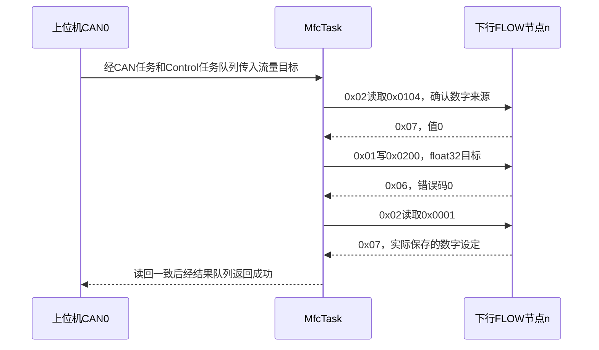
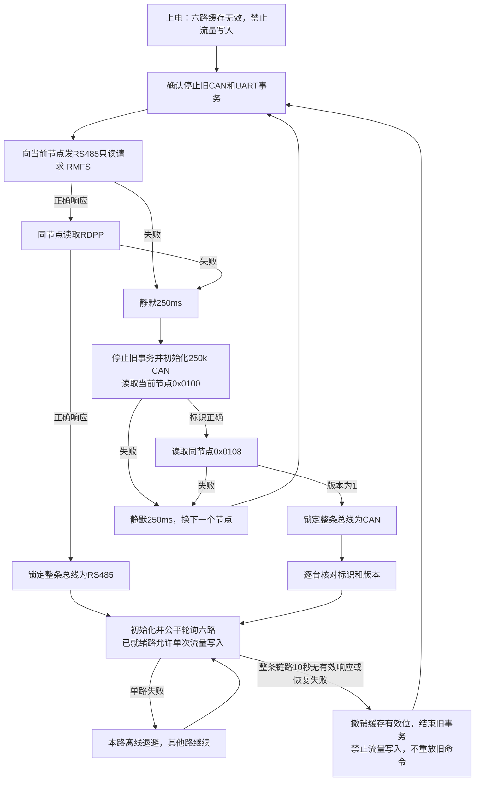

# MFC下行CAN_USER协议与自动识别

工程版本：V1.8.0.260920。下行参数表版本：1。日期：2026-09-20。

本文定义主板与六台CAN流量设备之间的协议，并对应本版代码。它是本项目自定义协议，沿用用户提供的CAN_USER帧格式，**不是EX-201S官方CAN协议**。现有EX-201S通过RS485使用厂家ASCII协议；CAN设备或转换模块需要另外实现本文的从站功能。主板代码已经实现主站收发、六路查询和写入确认，未包含对端固件，尚未实板验证。

## 1. 两条CAN总线与节点

| 项目 | 上位机侧 | 流量计侧 |
| --- | --- | --- |
| 控制器 | RA4M1内置CAN0 | SPI1连接MCP2515 |
| 波特率 | 现有500 kbit/s配置 | 用户确定250 kbit/s |
| 主板角色 | Type_FLOW=15，节点1 | Type_Header=0，节点1 |
| 对端 | 上位机Type_Header | 六台Type_FLOW=15，节点1～6 |
| 参数表 | CAN_USER通讯与参数表.md，版本2 | 本文，版本1 |

主板在两个独立总线上的角色不同。CAN节点号在ID中表示设备；参数地址表示该设备内部的参数。六台设备共用一张下行参数表，不能把上位机六路地址0x0200～0x0205直接转发下去。

例：上位机写主板0x0203，表示第4路；MfcTask改为向下行Type_FLOW/4写0x0200。查询由MfcTask自主轮询六路，上位机查询仍读取CAN任务自己的最新快照。

## 2. 帧格式与校验

使用经典CAN、29位扩展数据帧、DLC=8，不使用CAN FD或远程帧。

```text
ID = 功能码 << 24 | 目标类型 << 19 | 目标节点 << 12
   | 来源类型 << 7 | 来源节点
```

| ID位 | 长度 | 内容 |
| --- | --- | --- |
| 28～24 | 5 | 功能码 |
| 23～19 | 5 | 目标类型 |
| 18～12 | 7 | 目标节点 |
| 11～7 | 5 | 来源类型 |
| 6～0 | 7 | 来源节点 |

| 数据字节 | 内容 |
| --- | --- |
| D0、D1 | 参数地址，低字节在前 |
| D2 | 原CAN_USER自定义校验字节 |
| D3 | 参数数量；本下行版本固定1 |
| D4～D7 | uint32或IEEE-754 float32位模式，低字节在前 |

校验直接复用`F_CanUser_Checksum`：初值0xFFFF，按D0、D1、D3、D4、D5、D6、D7、ID最高字节的顺序，以右移和0xA001多项式累计CRC16；最终取`(uint8_t)(crc >> 4)`作为D2。校验不覆盖全部ID，所以接收方还必须逐项核对来源、目标、节点、功能码和参数。此算法沿用原CAN_USER，**不表示使用Modbus协议**。

| 功能码 | 用途 | 应答规则 |
| --- | --- | --- |
| 0x02 | 读取一个参数 | 对端0x07回复同一参数，D4～D7为值 |
| 0x07 | 读取应答 | 交换请求的来源与目标，数量仍为1 |
| 0x01 | 写入数字流量 | 对端0x06回复同一参数，D4～D7为错误码 |
| 0x06 | 写入应答 | uint32值0表示成功，1～255表示失败 |

本版不发送广播写、不使用周期主动上报、心跳、分段传输或连续多参数读取。每台从站仅响应发给自己的有效请求，不主动发送测量帧。

## 3. 下行参数表

地址分类保持用户规则：0x0000～0x00FF只读float32；0x0100～0x01FF只读uint32；0x0200～0x02FF读写float32；0x0300～0x03FF读写uint32。未列出的地址保留，不能由主板猜测用途。

| 地址 | 类型/权限 | 参数 | 约束或含义 |
| --- | --- | --- | --- |
| 0x0000 | float32，只读 | 瞬时流量 | 本通道单位，允许反向流量；按分辨率换算的尾数范围-9999～9999 |
| 0x0001 | float32，只读 | 当前数字设定流量 | 仪器实际保存值，非瞬时测量值，不能为负 |
| 0x0100 | uint32，只读 | 设备配置标识 | 必须为0x4D464301 |
| 0x0101 | uint32，只读 | 满刻度尾数 | 1～9999；满刻度工程值=尾数/10^小数位 |
| 0x0102 | uint32，只读 | 流量小数位 | 0～3，对应步长1、0.1、0.01、0.001 |
| 0x0103 | uint32，只读 | 流量单位 | 0=sccm，1=slm；标准温压条件由系统与设备配置一致保证 |
| 0x0104 | uint32，只读 | 流量设定来源 | 0数字通信，1模拟输入 |
| 0x0105 | uint32，只读 | 内部阀数字设定 | 0全开，1调节，2全关 |
| 0x0106 | uint32，只读 | 内部阀实际状态 | 0全开，1调节，2全关，3半开 |
| 0x0107 | uint32，只读 | 报警位 | bit0传感器异常，bit1内部阀过热，bit2存储异常；其他位为0 |
| 0x0108 | uint32，只读 | 下行参数表版本 | 必须为1 |
| 0x0200 | float32，读写 | 数字流量设定 | 唯一写参数；读取应与0x0001一致 |

元数据在一次在线会话内保持不变；若量程、小数位、单位或协议版本需要改变，从站应停止响应并重新建立会话，主板需要重新初始化，不能在运行中悄悄改变缩放关系。

主板保留现有六路尾数缓存，因此CAN收到的float32必须能按本通道小数位表示，NaN、无穷、越界和超出分辨率的值均拒绝。写目标要求0≤目标≤满刻度，且当前来源为数字控制；不自动切换模拟/数字来源，也不改内部阀模式。

设备标识和版本用于识别协议兼容性，并非身份认证或防伪机制。每个节点都要分别检查；节点1通过不能代表节点2～6通过。

## 4. 错误码与从站义务

写回复的D4～D7使用uint32编码，低8位有效，高24位必须为0。该空间可定义256个取值，本版建议如下，其余保留。

| 码 | 定义 |
| --- | --- |
| 0x00 | 已接收并完成数字设定值更新 |
| 0x01 | 参数值非法，例如NaN或超出分辨率 |
| 0x02 | 目标超出当前满刻度范围 |
| 0x03 | 设备尚未就绪或当前是模拟控制 |
| 0x04 | 参数地址不存在 |
| 0x05 | 参数只读 |
| 0x06 | 设备忙，本请求未执行 |
| 0x07 | 设备内部执行失败 |

主板把任意1～255的写失败记录在`A_MfcCan_Context.device_error`，通过现有执行结果返回上位机“设备拒绝”；目前没有新增上位机寄存器用于透传该原始码。高24位非零视为错误报文。读取应答没有额外错误位，不能在读取浮点或uint32参数的位置塞入错误码：读取参数不可用时不回复，主板按超时处理。以后若需读取错误详情，应另行增加有版本约束的参数，不能改变现有0x07值的含义。

对端只执行校验、目标、数量、权限和值都合法的写入；错误回复必须表示本笔写入未成功。写成功的回复必须在设定值已经更新之后发送。此时并不保证测得的气体流量已达到目标。

## 5. 主站收发及期限

单条总线同时只存在一笔业务事务；读请求D4～D7为0，从站收到完整有效请求后100ms内回复一次。主板从提交请求起等待最多200ms，发送完成最多等待50ms；错误后停止旧事务、清接收缓存并静默250ms。MCP2515使用One-Shot，仲裁失败或总线错误不自动重发写帧。软件同样不自动重发写命令。

原CAN_USER没有线上事务序号，因此无法无条件区分任意延迟的同节点、同地址、同功能码旧回复。对端必须遵守100ms响应上界，不排队发送超时回复，不重复发送已完成请求的回复。静默、缓存排空与字段匹配降低迟到干扰，不能替代该约束。若转换模块会长时间排队，应先扩展协议版本与事务序号，再投入控制使用。



写请求在队列中、等待来源确认时或软件待发槽中失去授权，将取消后续发送。已经上总线的命令无法撤回；写应答丢失也不能断言“未执行”。主板继续查询实际设定值，不自动补发旧写入，也不在切换到另一种通信方式后重放。

## 6. 内部自动识别状态图



节点1不在线时，探测继续到2～6再循环。每个节点先RS485后CAN，以两次不同的只读应答确认；单个报文、CAN硬件ACK、噪声和无关节点消息均不能锁定。锁定后只服务选中的后端；不在同一总线上混用两种协议，也不因另一后端收到一帧而切换。本实现采用确定的探测顺序，不持续扫描另一后端来检测“双协议同时在线”。

`MFC_EN2`同时影响485方向和CAN收发器待机，所以准备阶段必须确认旧事务停止。RS485使用已有驱动电平，CAN按原理图设计意图设为低；实板光耦电平仍待测量。`MFC_RES2`是终端电阻控制，不用于复位MCP2515，不由探测状态机修改。SPI软件RESET负责停止CAN；若旧事务停止失败，保留故障并再次尝试，不直接启动另一后端。

这里的“禁止写入”限定流量设定。上电九阀由原ControlTask逻辑关闭；本版没有增加“下行通信丢失自动关九阀/仪器归零”的整机过程策略，不能把重新探测等同于气路已处于安全状态。该策略需要后续明确停机条件并经任务间队列实现。

## 7. 函数与源码阅读顺序

| 文件 | 重点函数 | 用途 |
| --- | --- | --- |
| App/A_System.c | A_System_ProcessMfc | 命令出队、授权、推进MFC、快照及结果入队 |
| Mfc/A_MfcLink.c | A_MfcLink_Process | 停止旧后端、只读探测、连续确认、失联重探测 |
| Mfc/A_MFC.c | A_MFC_Process、A_MFC_ProcessCommand | 六路公平轮询及写入状态机，选择已锁定后端 |
| Mfc/A_MfcCan.c | A_MfcCan_Start | 用F_CanUser_Encode构造请求，只排队不操作SPI |
| Mfc/A_MfcCan.c | A_MfcCan_Process、GetInfo、GetFlow | 核对回应字段、期限、类型和范围，更新公共参数 |
| Mfc/F_MfcCan.c | F_MfcCan_Initialize/Send/Receive/Process/Stop | 功能层传输接口，直接调用硬件层 |
| Mfc/H_MfcCan.c | H_MfcCan_Initialize | SPI RESET、8MHz/250k时序、扩展ID过滤、One-Shot |
| Mfc/H_MfcCan.c | H_MfcCan_Process、H_MfcCan_ReadBuffer | 轮询错误和RXB0/RXB1、载入TXB0并发送 |
| Mfc/H_MfcCan.c | H_MFC_CAN_SpiCallback | 只记录SPI完成和错误，沿用FSP回调名 |
| Mfc/H_MfcCan.c | H_MfcCan_Stop | 停止旧CAN发送并清缓冲，失败禁止直接换485 |

MCP2515的INT没有连接，MfcTask用SPI轮询。CNF1=0x01、CNF2=0x98、CNF3=0x01，对应8MHz晶振、8个TQ、250 kbit/s、75%采样点；依据本项目Microchip DS20001801K第5章、寄存器5-1～5-3。SPI沿用FSP主机、Mode 0、1MHz、SSL0低有效；每条MCP命令用一次8bit writeRead，不能在命令中间释放片选。

SPI短事务以回调标志完成，单条指令最多等待1000次1us延时，中断保持开启；被高优先级任务抢占的时间不计入这1000次。业务应答不忙等。实际SPI时长、总线突发、调度延迟和1024字节任务栈峰值尚待实板测量。START阶段在临界区内只复制CAN待发帧，硬件推进和错误恢复在后续开中断的任务运行中完成。

八个任务间队列保持现有职责。MCP2515的接收环形缓冲和待发槽属于MfcTask内部，不是HostCanStack与MfcTask之间的共享状态。

## 8. 可以对照CAN分析仪的帧示例

以下均为扩展帧、DLC=8、主板Header/1与设备FLOW/1。

| 操作 | CAN ID | D0～D7 |
| --- | --- | --- |
| 读取设备标识 | 0x02781001 | 00 01 BD 01 00 00 00 00 |
| 标识回复0x4D464301 | 0x07001781 | 00 01 9E 01 01 43 46 4D |
| 读取瞬时流量 | 0x02781001 | 00 00 BC 01 00 00 00 00 |
| 瞬时流量回复1.0 | 0x07001781 | 00 00 01 01 00 00 80 3F |
| 写数字流量1.0 | 0x01781001 | 00 02 2B 01 00 00 80 3F |
| 写成功回复 | 0x06001781 | 00 02 8E 01 00 00 00 00 |

节点2～6改变ID的目标或来源节点字段；D2仍必须按实际帧重新计算。发送写示例前先完成身份、元数据及数字来源检查。

## 9. 本版验证

本地模拟运行真实A/F/H_MfcCan、CAN_USER编解码和A_MFC调度，仅替换SPI硬件寄存器和仪器端。覆盖250k寄存器、ID打包、标准/远程/短帧拒绝、SPI错误与超时、CAN发送失败与超时、接收溢出、关联字段、标识/版本、六路采集、写后读回、写ACK丢失不重发、未发送写取消、单路掉线、双向失联重探测及节拍回绕。

测试目录按用户现有.gitignore保留在本地。实板SPI波形、EN电平、CAN ACK、线束终端、对端兼容性和气路动作不在模拟测试结论之内。
