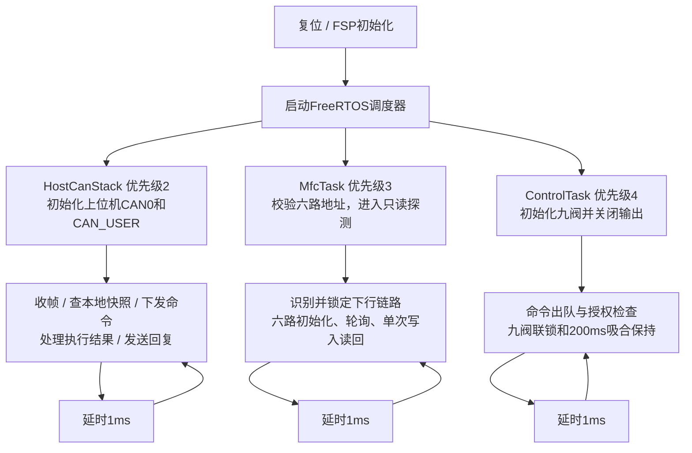
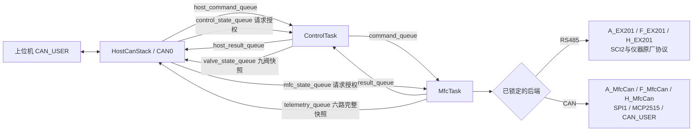
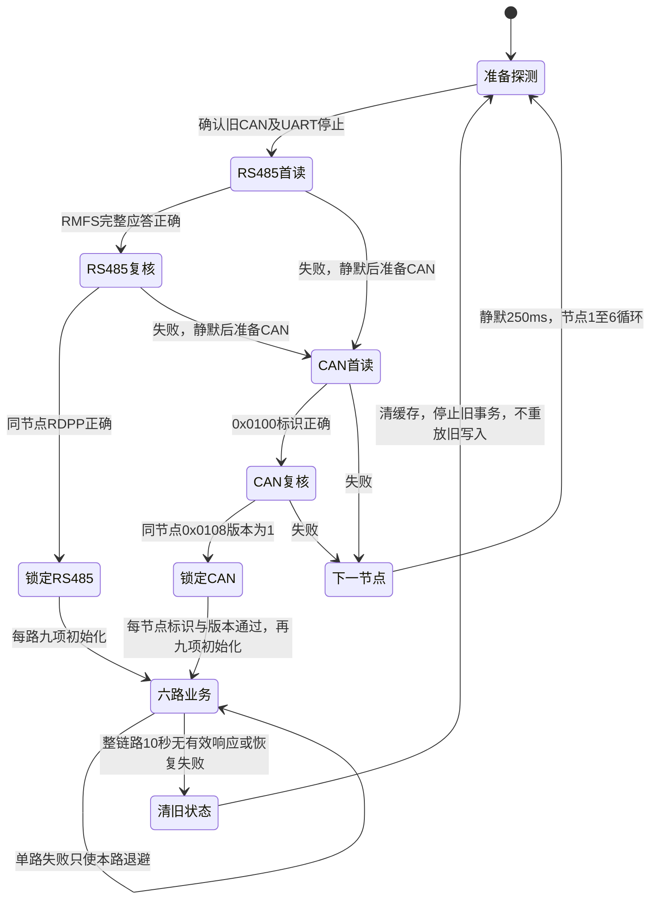
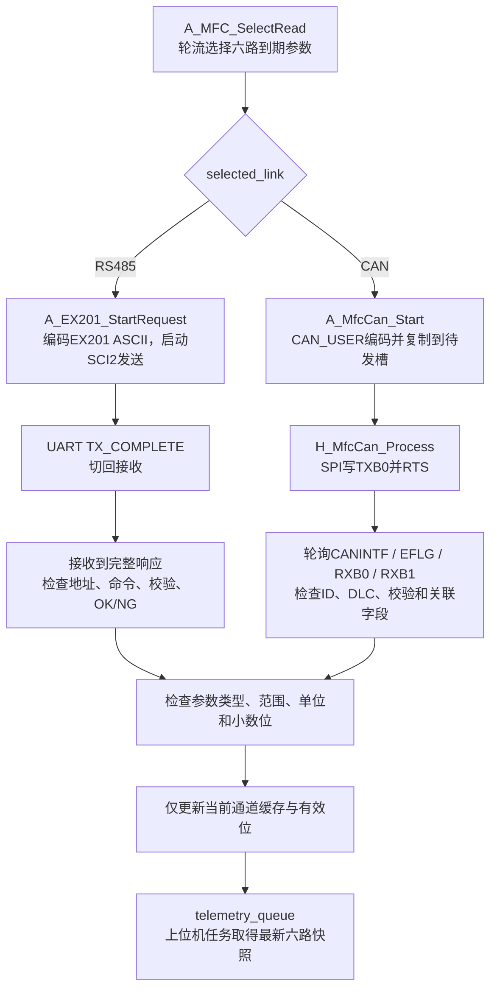
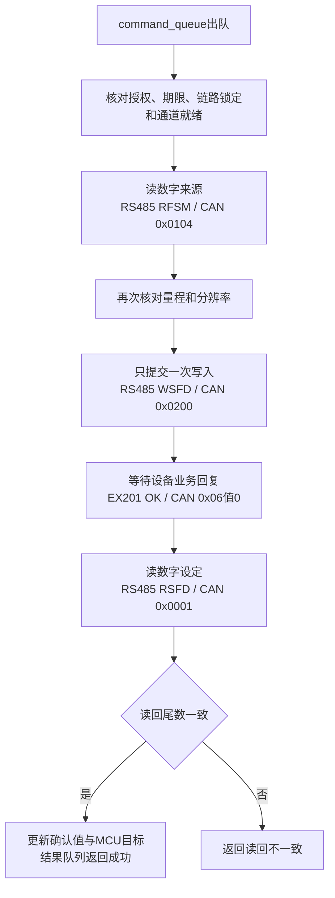

# 主板软件运行流程：FreeRTOS

适用版本：V1.8.0.260920。更新日期：2026-09-20。本文描述当前代码；历史Word、XMind和Visio方案以README注明的版本为准。

三个任务保持不变：HostCanStack负责上位机CAN0，MfcTask负责两个下行候选后端和六个通道，ControlTask负责命令协调及九阀控制。任务间全部使用现有八个静态FreeRTOS队列。下行CAN为250 kbit/s、FLOW节点1～6，使用本项目自定义CAN_USER参数表1；RS485仍使用EX-201S原厂ASCII协议。

## 1. 上电与三个任务

任务栈各1024字节，实际峰值和调度延迟待实板测量。驱动由所属任务打开，两个下行后端按探测阶段依次准备；不在调度器启动前等待六台设备上线。1ms是任务延时间隔，不是完整六路扫描时间。

## 2. 任务间的命令和数据

上位机查询读取HostCanStack自己的快照；MFC自主循环采集，不等待上位机发起每笔测量。上位机写请求由Control转成通道和业务操作，原始CAN0帧不会直接转发到MCP2515。每次只允许一笔未完成写命令，快照队列覆盖最新完整状态。

## 3. MfcTask内部识别

由`A_MfcLink_Process`管理探测。同一节点的两个不同只读应答均正确才锁定；一个节点足够确认链路，之后仍独立管理六路。锁定后不再扫描另一后端，不按单个报文反复切换。

`MFC_EN2`同时影响RS485方向和CAN待机，两后端不能随意并行改变该脚。停止旧事务失败时保持故障并重试；固件不读取外部跳线，不更改`MFC_RES2`终端策略。CAN采用本项目协议，需要兼容设备或转换模块，不能直接假定EX-201S支持CAN。

## 4. 两种后端的单笔读取

RS485发送期限100ms，应答期限从发送完成后起算500ms；CAN从提交请求起200ms，MCP2515单帧发送50ms。SPI单条命令有界等待完成，中断保持开启，业务应答通过状态机等待。CAN错误后静默250ms，RS485错误后50ms；实际响应上界与迟到帧仍需联调确认。

## 5. 单次流量写入

完整请求期限3000ms，包含排队。写入、应答或读回失败不自动重发；应答丢失时设定可能已生效。CAN待发槽在下一轮授权检查通过后才推进硬件；取消时尚未发出的帧丢弃，已发出的动作无法撤回。

## 6. 九阀与当前实现边界

V1～V6独立，V7与V9同步、共同与V8互斥。CAN通过V7控制这对阀，V9地址只读。新开阀由ControlTask控制12V吸合200ms后约5V保持，三组共享电压；规则和GPIO实现沿用已有版本。

本版探测期间禁止流量写入，但未加入下行失联后自动关闭所有外部阀或将仪器归零的完整气路过程。重新探测不能被解释为已确认气路安全停机。详见[九路电磁阀执行说明](九路电磁阀执行说明.md)。

实际函数索引见[主板运行流程与收发函数说明](主板运行流程与收发函数说明.md)第14节；新参数表、错误码、报文样例和响应约束见[MFC下行CAN_USER协议与自动识别](MFC下行CAN_USER协议与自动识别.md)。模拟测试和编译通过不等于实板通信、使能电平、阀门或气路验证完成。
