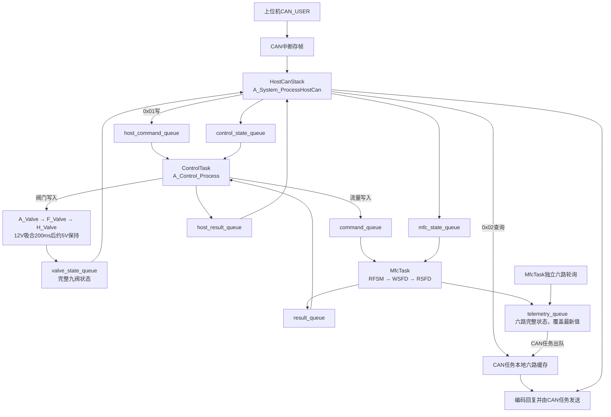

# 主板运行流程与收发函数说明

适用代码版本：**V1.7.0.260919**。文档修订：R4。更新日期：2026-09-19。

本版按[AGENTS.md](../../../AGENTS.md)整理：各模块状态独立存放，访问成员最多两次跳转；关键流程使用展开的条件、明确状态名和步骤注释。

本文集中记录当前工程的启动、三个任务、CAN收发、EX201/RS485收发、六路轮询、流量写入及异常处理。函数名按当前源码核对。后续改变运行流程时优先维护本文件。

当前完成的下行路径为SCI2/RS485上的EX-201S自带协议。上位机为CAN0/CAN_USER。MFC侧MCP2515/CAN_USER、双协议自动识别及完整气路过程联锁尚未接入；九阀电气执行及V7/V9与V8互斥已接入，不能将历史设计图中的规划状态视为当前已实现流程。

“内部函数”指对应.c内的static函数，只能由该模块调用。表中的调用箭头表示先后关系，不表示每一步都在同一次1ms任务运行中完成。硬件发送启动、发送完成和仪器应答是三个不同阶段。

## 阅读导航

- 第1～3节：任务、启动、整体路径和队列数据。
- 第4～5节：六路轮询及EX201串口收发。
- 第6～7节：CAN接收与上位机查询。
- 第8～9节：流量写入、结果交接和CAN发送。
- 第10节：超时、错误、离线及取消。
- 第11～12节：完整示例、调试入口和源码索引。

## 1. 三个任务与启动顺序

| 任务 | 入口函数 | 当前循环调用 | 优先级 / 栈 | 实际职责 |
| --- | --- | --- | --- | --- |
| HostCanStack | HostCanStack_entry | A_System_ProcessHostCan → A_HostCan_Process | 2 / 1024字节 | 取CAN接收帧、解析CAN_USER、读取参数、接受写请求、发送回复 |
| ControlTask | ControlTask_entry | A_System_ProcessControl → A_Control_Process | 4 / 1024字节 | 出队领取写请求、执行九阀200ms状态机或转发MFC命令、发布状态及结果 |
| MfcTask | MfcTask_entry | A_System_ProcessMfc | 3 / 1024字节 | 六路初始化与轮询、队列命令执行、唯一EX201事务、参数发布 |

三个入口末尾均使用vTaskDelay(pdMS_TO_TICKS(1U))让出CPU；当前节拍为1000Hz。优先级数字越大越高，任务实际启动和交替顺序由调度器决定，不能按main中创建任务的顺序推断业务执行顺序。1ms是任务推进间隔，不是一次总线通信必须在1ms完成。

### 1.1 进入调度器

```text
复位及FSP运行时初始化
  → main                               [ra_gen/main.c]
      → 创建公共初始化信号量
      → HostCanStack_create
      → MfcTask_create
      → ControlTask_create
      → vTaskStartScheduler
          → 各任务的FSP包装函数
              → rtos_startup_common_init
                  → 首个进入的任务执行g_hal_init
              → 对应的任务入口*_entry
```

FSP包装函数分别为HostCanStack_func、MfcTask_func、ControlTask_func，均位于ra_gen对应文件。公共初始化利用信号量保证只执行一次。FreeRTOS工程的业务循环位于三个任务入口中。

### 1.2 启动配置与任务所有权

三个任务的A_System_Process入口均先检查A_System_Initialize，首个进入者在临界区中创建八个静态队列；已成功创建的队列不重建。创建失败时下次重试，不清空已创建队列。queues_ready只表示启动配置完成，完成后保持不变；运行中的业务就绪、链路和请求状态都走队列。

| 执行位置 | 函数 | 建立的条件 |
| --- | --- | --- |
| 三个任务入口 | A_System_GetContext | 获得静态上下文入口和队列句柄；禁止读取其他任务的业务成员 |
| 三个A_System_Process入口 | A_System_Initialize → 八处直接调用xQueueCreateStatic | 初始化八个长度1队列；数据区及控制块均静态分配 |
| HostCanStack | A_HostCan_Initialize → F_HostCan_Initialize → H_HostCan_Initialize | 打开CAN0；失败间隔1000ms重试 |
| MfcTask | A_MFC_DefaultConfig → A_MFC_Initialize | 地址默认001～006，验证1～999且互不重复 |
| MfcTask后续循环 | A_MFC_Process → A_EX201_Initialize → F_EX201_Initialize → H_EX201_Initialize | 打开SCI2；失败间隔5000ms重试 |
| ControlTask | A_Control_Initialize | 绑定本任务使用的六个队列并初始化九阀输出，不取得CAN或MFC业务指针 |
| MfcTask → CAN队列 | A_System_ProcessMfc → xQueueOverwrite | 六路数据、link和ready一起复制到telemetry_queue |
| HostCanStack | A_System_ReceiveTelemetry → A_HostCan_SetExecutors | 根据六路快照启用MFC执行能力，保留阀执行位；阀状态由A_System_ReceiveValveState单独接收 |

ready只表示MFC执行入口已接入，设备在线、初始化、量程和数字来源仍逐笔验证。CAN先启动可查询版本，MFC尚未就绪时拒绝写入；CAN晚启动可取得覆盖队列里保留的最新六路状态。

## 2. 整体运行路径



所有任务间消息都通过FreeRTOS队列按值复制。A_HostCan_PublishChannel、TakeCommand、CommandActive和CompleteCommand现在都只在CAN任务内调用；这些函数不会自动切换任务。MFC轮询和写入仍共用唯一A_EX201_Context，同一时刻只有一个串口事务。

## 3. 八个FreeRTOS队列及任务本地缓冲

创建位置：A_System_Initialize → 八处直接调用xQueueCreateStatic。全部队列长度为1，均使用静态内存，入队和出队等待时间为0。

| 队列 | 方向 | 元素类型 | 满时处理 |
| --- | --- | --- | --- |
| host_command_queue | CAN → Control | A_HostCan_Command | xQueueSendToBack失败则返回BUSY，不覆盖旧命令 |
| command_queue | Control → MFC | A_MFC_Command | 失败则形成BUSY结果 |
| result_queue | MFC → Control | A_MFC_CommandResult | 保留MFC的DONE结果，下次重试 |
| host_result_queue | Control → CAN | A_Control_Host_Result | Control保留pending_result，暂不领取新命令 |
| valve_state_queue | Control → CAN | A_HostCan_System，九阀输出/目标/阶段/故障 | xQueueOverwrite保留最新完整快照 |
| telemetry_queue | MFC → CAN | A_System_Telemetry，含六路完整数据、link、ready | xQueueOverwrite保留最新完整快照 |
| control_state_queue | CAN → Control | A_Control_Host_State | xQueueOverwrite保留最新请求有效状态 |
| mfc_state_queue | CAN → MFC | A_Control_Host_State | xQueueOverwrite保留最新请求有效状态 |

两个状态消费者各有独立队列，不能共用一个接收队列，否则一个任务出队后另一个会收不到消息。快照也不能把单路消息放在同一个长度1覆盖队列中：那样后一路会覆盖前一路。因此telemetry_queue的一个元素必须包含六路。

A_HostCan_Command保留内部sequence和原始32位数据。A_MFC_Command包含sequence、index、operation、target_flow、started_tick、timeout_ticks。A_Control_Host_State包含sequence、started_tick、updated_tick、valid。序号和时间仅用于MCU内部，原CAN_USER线上格式不增加字段。

| 本地对象 | 所有者 / 用途 |
| --- | --- |
| g_host_can.command、requester、command_state | CAN任务独占，用于关联原请求与延迟回复；不再供其他任务领取 |
| g_host_can.channels | CAN任务出队后更新的本地查询缓存，MfcTask不得直接读写 |
| g_mfc_channels、g_mfc_telemetry、g_system.published_revision | MfcTask独占，采集及组成六路完整发送快照 |
| g_host_telemetry | CAN任务独占的接收缓冲，静态持有以减少栈占用 |
| g_control.host_state、g_system.mfc_host_state | 两个消费者分别出队取得的状态副本 |
| H_HostCan接收环形缓冲16帧 | CAN中断与CAN任务之间的驱动缓冲 |
| A_HostCan发送缓冲32帧 | CAN任务内部的待发送数组 |
| H_EX201接收环形缓冲64字节 | SCI2中断与MfcTask之间的驱动缓冲 |

中断与所属任务的驱动缓冲仍保留原实现；本次统一的是任务之间的业务交接。任务内部成员不会因为函数名字带HostCan或MFC就成为跨任务消息。

## 4. 六路初始化与周期轮询

### 4.1 MfcTask每轮的实际调用顺序

```text
MfcTask_entry → A_System_ProcessMfc
  1. A_System_Initialize检查启动队列配置
  2. IDLE时xQueueReceive(command_queue) → A_MFC_SubmitCommand
  3. xQueueReceive(mfc_state_queue)取得本任务状态副本
       → A_Control_RequestValid检查请求号、起点、状态年龄和总期限
       → A_MFC_ProcessCommand推进写流程
  4. A_MFC_Process推进六路轮询
  5. A_MFC_GetChannel检查六路revision
       → A_System_MapChannel更新mfc_telemetry中的对应通道
  6. A_MFC_GetLink取得链路
       → 数据或link/ready改变时xQueueOverwrite(telemetry_queue)
  7. A_MFC_GetCommandResult
       → xQueueSendToBack(result_queue)成功后A_MFC_ReleaseCommand
  8. vTaskDelay，等待下一轮
```

MFC先把更新后的完整快照入队，再把执行结果入队。CAN任务接收执行结果后再次检查telemetry_queue，处理MFC可能在两次出队之间抢占的情况，然后才提交执行完成。CAN晚启动或消费缓慢时只保留最新一组状态，不会积压历史采样。

### 4.2 六路初始化读取

A_MFC_Process在总线空闲时调用内部函数A_MFC_SelectRead选择操作，再由A_MFC_StartRead调用下表业务接口。

| 顺序 | EX201命令 | 调用函数 | 缓存字段 |
| --- | --- | --- | --- |
| 1 | RMFS | A_EX201_ReadFullScale | device_info.full_scale_mantissa |
| 2 | RDPP | A_EX201_ReadDecimalPlaces | device_info.decimal_places |
| 3 | RFRU | A_EX201_ReadFlowUnit | device_info.flow_unit |
| 4 | RCFR | A_EX201_ReadActualFlow | actual_mantissa、sampled_tick |
| 5 | RSFD | A_EX201_ReadSetFlow | confirmed_mantissa |
| 6 | RFSM | A_EX201_ReadFlowSource | device_info.flow_source |
| 7 | RVSS | A_EX201_ReadValveSetting | device_info.valve_setting |
| 8 | RCVS | A_EX201_ReadValveState | device_info.valve_state |
| 9 | RALM | A_EX201_ReadAlarmState | device_info.alarm_state |

正常情况下先六路各读RMFS，再六路各读RDPP，逐项交替。每路独立记录initialize_step；失败的路进入退避，其他路继续。初始化状态为A_MFC_INIT_RUNNING，九项全部成功后进入A_MFC_INIT_READY。

### 4.3 运行中的周期查询

| 查询 | 默认目标间隔 | 调度方法 |
| --- | --- | --- |
| RCFR瞬时流量 | 每路500ms | actual_attempt_tick判断到期 |
| RSFD、RFSM、RVSS、RCVS、RALM | 每路1000ms取其中一项，每项约5s | status_step依次轮换 |
| 离线设备重试 | 5000ms | 从RMFS重新开始初始化 |

实际完成时间受串口和设备响应影响，时间到期不表示立即发送。A_MFC_SelectRead在流量和状态同时到期时交替优先，避免状态长期得不到读取；next_channel保证跨通道轮转。

结果由A_EX201_GetFlowResult或A_EX201_GetDeviceInfoResult解析，再由内部A_MFC_Finish更新在线、失败计数、revision及初始化进度。

### 4.4 发布成上位机可读数值

MfcTask调用A_System_MapChannel，按各路自身小数位把尾数转换为工程值，显式映射有效标志，更新本任务mfc_telemetry。随后xQueueOverwrite将六路完整消息复制到telemetry_queue。

CAN任务调用A_System_ReceiveTelemetry，通过xQueueReceive取得消息，再在本任务内调用A_HostCan_PublishChannel更新g_host_can.channels。上位机查询只读这个本地缓存，不跨任务访问MFC内存。sampled_ms保留仪器采样时间，不能在出队时重置数据年龄。

## 5. EX201／RS485发送和接收

### 5.1 发送请求：从业务函数到SCI2

```text
A_EX201_ReadActualFlow / ReadSetFlow / ReadFlowSource等
  → A_EX201_StartOperation                 内部：标记本次业务操作
      → A_EX201_StartRequest              检查空闲，保存预期地址和命令
          → F_EX201_EncodeRequest         生成@地址+命令+数据+校验+CR
          → F_EX201_SendFrame
              → H_EX201_Send
                  → 复制到长期有效transmit_buffer
                  → H_EX201_SetDirection  内部：通过MFC_EN2切到发送方向
                  → g_mfc_uart.p_api->write
      → 事务进入WAIT_TX_COMPLETE
```

A_EX201_SetFlow在上述公共路径之前，还调用F_EX201_EncodeFlowValue把尾数编码为四位ASCII。F_EX201_EncodeRequest内部使用F_EX201_CalculateChecksum计算累加校验，校验结果以两个十六进制ASCII字符发送。RS485使用EX201协议，不使用Modbus。

H_EX201_Send返回成功仅表示UART异步发送已启动。缓冲区必须持续存在，不能依赖任务函数中的临时数据。

### 5.2 发送完成：切换接收方向

| 步骤 | 执行位置 / 函数 | 动作 |
| --- | --- | --- |
| 1 | SCI2/FSP发送完成中断 | 最后字节发送结束后产生UART_EVENT_TX_COMPLETE |
| 2 | H_EX201_UartCallback | 调用H_EX201_SetDirection切回接收，清transmit_busy |
| 3 | A_EX201_Process | 经F_EX201_IsTransmitBusy → H_EX201_IsTransmitBusy确认发送结束 |
| 4 | A_EX201_Process | 进入WAIT_RESPONSE，重新记录state_start_tick |

H_EX201_SetDirection最终调用g_ioport.p_api->pinWrite。当前源码发送电平为LOW、接收为HIGH，是待实板测量确认的配置。不能把UART发送缓冲区空当作整帧发送完成。

### 5.3 接收响应：从UART字节到业务数据

```text
仪器应答
  → SCI2/FSP接收中断：UART_EVENT_RX_CHAR
      → H_EX201_UartCallback
          → 字节写入receive_buffer
  → MfcTask再次运行
      → A_EX201_Process
          → F_EX201_ReceiveFrame
              → H_EX201_ReceiveByte逐字节取出
              → 等待%起始，收到CR构成完整帧
          → A_EX201_HandleResponse        内部
              → F_EX201_DecodeResponse
              → 检查校验、地址、命令及OK/NG
          → COMPLETE或ERROR
      → 对应GetResult函数取结果并使事务恢复IDLE
```

F_EX201_ReceiveFrame只读取现有接收字节；缓冲区没有字节即返回NO_FRAME，任务下次再推进。UART中断不做EX201业务解析，也不直接更新上位机参数。

| 结果读取函数 | 调用者 | 作用 |
| --- | --- | --- |
| A_EX201_GetDeviceInfoResult | A_MFC_Process、A_MFC_ProcessCommand | 读取RMFS/RDPP/RFRU/RFSM/RVSS/RCVS/RALM并检查字段格式和范围 |
| A_EX201_GetFlowResult | A_MFC_Process、A_MFC_ProcessCommand | 解析RCFR或RSFD尾数；内部调用F_EX201_DecodeFlowValue |
| A_EX201_GetCommandResult | A_MFC_ProcessCommand | 取得WSFD执行结果 |
| A_EX201_GetResult | 上述三个接口内部 | 取走当前结果并清回IDLE；未完成返回BUSY |

事务状态主线为IDLE → WAIT_TX_COMPLETE → WAIT_RESPONSE → COMPLETE/ERROR → IDLE。WAIT_TX_COMPLETE及WAIT_RESPONSE分别有100ms、500ms期限；不能在COMPLETE后不取结果就启动下一笔。

## 6. 上位机CAN接收过程

### 6.1 中断只存帧

1. CAN0/FSP在收到帧后调用H_HostCan_Callback，事件为CAN_EVENT_RX_COMPLETE。
2. 检查29位扩展数据帧、8字节长度及接收环形队列容量。
3. 保存id和data到H_HostCan_Context.receive，更新write_index和receive_count。
4. 非法帧或队列已满时计入dropped_frames；此时尚未解析流量、参数地址或目标值。

### 6.2 HostCanStack取帧并解析

```text
HostCanStack_entry
  → A_HostCan_Process
      → A_HostCan_ServiceTransmit         先推进已有发送或恢复
      → A_HostCan_ServiceCommand          处理写结果及总期限
      → F_HostCan_Receive
          → H_HostCan_Receive             在临界区从接收环形队列取一帧
      → F_CanUser_Decode
          → F_CanUser_Checksum            检查原CAN_USER自定义校验
      → A_HostCan_HandleRequest           内部：判断查询或修改
```

每次最多处理4个接收请求；发送队列不足以容纳最大连续读回复时暂停取新请求。解析失败计入invalid_frames，目标类型、目标地址、来源类型或功能不符合当前范围则计入ignored_frames。

F_CanUser_Decode解析function、source_type、source_address、target_type、target_address、address、count和value。当前目标为Type_FLOW、默认地址1；来源为Type_Header；处理定向0x01写和0x02读。广播、主动上报和心跳当前不执行。

## 7. 上位机查询过程

| 顺序 | 函数 | 动作 |
| --- | --- | --- |
| 1 | A_HostCan_HandleRequest | 确认0x02，检查数量1～16及地址边界 |
| 2 | A_HostCan_ReadParameter | 对每个参数取缓存快照，检查地址、有效位及该字段要求的在线/时效条件 |
| 3 | F_CanUser_FloatToBits | float参数转成32位位模式；uint32参数直接使用 |
| 4 | A_HostCan_QueueReply | 每个参数生成一帧0x07回复并入发送队列 |
| 5 | A_HostCan_ServiceTransmit | 后续任务循环异步发送，详见第9节 |

0x0000～0x0005为六路实际流量，0x0010～0x0015为仪器读回设定，0x0020～0x0025为满量程，0x0200～0x0205为已写入并读回确认的目标。

一次连续读会先验证所有参数；任何一项失败则整组不返回参数帧。A_HostCan_RecordError保存最近出错地址、业务码和原功能码，对应0x010C、0x010D、0x010E。原协议没有通用读错误帧，不能把错误码装入0x07的流量数据。

实际流量年龄超过2000ms返回STALE诊断；未采到或失效的数据不能用默认零值冒充。查询过程不向command_queue发送命令，也不临时发起RS485读取。

## 8. 上位机修改流量过程

### 8.1 CAN层接受请求

A_HostCan_HandleRequest识别0x01后调用内部A_HostCan_StartWrite：

- 检查数量必须为1、地址定义及读写属性。
- 对0x0200～0x0205计算index=address-0x0200。
- F_CanUser_BitsToFloat取得工程值，检查有限、非负、量程、在线、初始化、数字来源及执行器接入。
- 有旧写请求时返回BUSY；否则生成sequence并保存A_HostCan_Command和requester。
- command_state置1，表示等待CAN任务自身提取入队；此时不回复成功。

接受失败时直接A_HostCan_RecordError → A_HostCan_QueueReply，使用0x06返回错误码，不进入MFC队列。

### 8.2 CAN和Control通过命令队列交接

```text
HostCanStack：A_System_ProcessHostCan
  → A_HostCan_Process接受请求
  → A_HostCan_TakeCommand提取本地请求，command_state从1变2
  → xQueueSendToBack(host_command_queue)
  → A_HostCan_CommandActive形成请求有效状态
  → xQueueOverwrite(control_state_queue / mfc_state_queue)

ControlTask：A_System_ProcessControl → A_Control_Process
  → xQueueReceive(control_state_queue)更新本任务状态副本
  → 先处理result_queue及尚未交出的pending_result
  → 空闲时xQueueReceive(host_command_queue)
  → A_Control_RequestValid检查状态与期限
  → F_CanUser_BitsToFloat并组装A_MFC_Command
  → xQueueSendToBack(command_queue)
```

CAN命令入队与两个有效状态发布处于同一短临界区，防止更高优先级任务先领取命令却还没有收到对应状态。Control不调用A_HostCan_TakeCommand、CommandActive或CompleteCommand，也不访问CAN上下文。

任何命令队列满都返回BUSY；Control把错误结果保留在pending_result并送入host_result_queue。只有成功入command_queue才记录active_sequence；Control等待该请求结果，串口由MfcTask独占。

### 8.3 MfcTask实际执行

| 写状态 | 使用的函数 | 行为 |
| --- | --- | --- |
| IDLE → PENDING | A_System_ProcessMfc → xQueueReceive → A_MFC_SubmitCommand | 从队列复制一笔命令 |
| PENDING | A_MFC_ProcessCommand、内部A_MFC_CheckTarget | 等当前轮询及错误静默期结束；再次核对在线、元数据、量程和分辨率 |
| PENDING → SOURCE | A_EX201_ReadFlowSource | 发送RFSM确认当前来源 |
| SOURCE → START | A_EX201_Process → A_EX201_GetDeviceInfoResult | 更新真实来源；下一步再次检查数字来源 |
| START → ACK | A_MFC_CheckTarget → A_EX201_SetFlow | 目标换算为四位尾数，只启动一次WSFD |
| ACK → READBACK | A_EX201_Process → A_EX201_GetCommandResult | 收到OK后准备读回；NG或错误走失败结果 |
| READBACK → VERIFY | A_EX201_ReadSetFlow | 发送RSFD |
| VERIFY → DONE | A_EX201_Process → A_EX201_GetFlowResult → 内部A_MFC_EndCommand | 读回尾数与write_mantissa一致才成功 |
| DONE → IDLE | A_MFC_GetCommandResult → xQueueSendToBack(result_queue) → A_MFC_ReleaseCommand | 结果成功入队后释放；队列满则保留DONE |

A_System_ProcessMfc每轮从mfc_state_queue更新本地状态，调用A_Control_RequestValid校验请求。状态出队、最终有效性检查及WSFD非阻塞启动放在短临界区，避免已入队的新状态在检查和启动之间被插入。CAN物理故障尚未被CAN任务发布时，MFC无法立即知道；状态最长有效20ms，详见第10节。

工程值乘以10的小数位次方得到尾数，范围不得超过0～9999及该路满量程。超出仪器分辨率返回VALUE，仅容许float32表达/运算误差，不任意舍入。

尝试WSFD时撤销旧目标和读回有效位。RSFD读回相同后才恢复目标有效位、更新target_mantissa及confirmed_mantissa；读回不同则保存仪器真实读回值，目标仍无效，返回VERIFY。成功仅代表数字设定及读回一致，不代表流量已经稳定到目标。

### 8.4 执行结果通过两个队列回到CAN任务

```text
MfcTask：A_System_ProcessMfc
  → xQueueOverwrite(telemetry_queue)，先发布确认数据
  → A_MFC_GetCommandResult
  → xQueueSendToBack(result_queue)
  → 成功后A_MFC_ReleaseCommand

ControlTask：A_Control_Process
  → xQueueReceive(result_queue)
  → 对比active_sequence
  → A_Control_MapResult转成CAN业务码
  → 保存pending_result
  → xQueueSendToBack(host_result_queue)，满则保留待下次发送

HostCanStack：A_System_ProcessHostCan
  → xQueueReceive(host_result_queue)
  → A_System_ReceiveTelemetry再次检查最新快照
  → A_HostCan_CompleteCommand，编号和期限匹配才置command_state=3
  → A_HostCan_Process → A_HostCan_ServiceCommand
  → A_HostCan_QueueReply生成0x06
```

队列入队、CAN任务接收结果、CAN回复入发送缓冲和CAN物理发送完成是不同事件。迟到或旧编号结果不能完成新请求。

## 9. MCU向上位机发送CAN回复

查询成功、写请求立即被拒绝、写执行完成最终都使用同一个发送路径：

```text
A_HostCan_QueueReply
  → 组装F_CanUser_Message
      来源：本机Type_FLOW及本机地址
      目标：原请求来源类型及地址
      参数地址保留，count=1
      查询：0x07 + 参数32位数据
      写入：0x06 + 业务结果码
  → F_CanUser_Encode
      → F_CanUser_Checksum
  → 存入A_HostCan_Context.transmit

下一轮A_HostCan_Process
  → A_HostCan_ServiceTransmit
      → F_HostCan_GetTransmitState → H_HostCan_GetTransmitState
      → 空闲时F_HostCan_Send
          → H_HostCan_Send
              → 复制到长期有效transmit帧缓冲
              → g_can0.p_api->write，使用邮箱0
      → 等待发送完成

CAN0/FSP发送完成中断
  → H_HostCan_Callback，CAN_EVENT_TX_COMPLETE且邮箱0
      → 清transmit_busy

后续A_HostCan_ServiceTransmit
  → 确认硬件完成
  → 移动transmit_read、递减transmit_count
  → 可以发送下一帧
```

H_HostCan_Send成功仅表示外设接受了发送请求。发送队列有数据时也不表示数据已出现在总线上；HostCanStack持续推进队首，发送期间缓冲保持有效。

## 10. 异常处理和期限

| 异常 / 期限 | 实际函数 | 当前处理 |
| --- | --- | --- |
| UART发送100ms未完成 | A_EX201_Process → A_EX201_RecoverAndSetError | 报TX_TIMEOUT并恢复通信 |
| 等仪器响应500ms | A_EX201_Process → A_EX201_RecoverAndSetError | 报RESPONSE_TIMEOUT；期限从发送完成被任务确认时起算 |
| EX201校验、地址、命令、格式错误 | A_EX201_HandleResponse、各GetResult接口 | 返回协议类错误，不污染成功字段 |
| UART接收错误或缓冲溢出 | H_EX201_UartCallback、H_EX201_ReceiveByte | 记录错误/清理缓冲，任务获得错误后恢复 |
| 恢复RS485 | A_EX201_Recover → F_EX201_Recover → H_EX201_Recover | 调用UART communicationAbort中止TX、恢复接收方向并清理接收缓冲 |
| 单路查询失败 | A_MFC_Finish → A_MFC_InvalidateField | 立即撤销本字段有效位 |
| 初始化失败，或就绪后连续3次失败 | A_MFC_Finish → A_MFC_MarkOffline | 全路数据失效、offline；5000ms后从量程重新初始化 |
| 共享硬件恢复失败 | A_MFC_TransportFailed | 六路离线；5000ms后重试共享传输 |
| 错误后静默50ms | A_MFC_Process、A_MFC_ProcessCommand | 静默结束才允许后续请求，具体迟到应答上界待实机确认 |
| 写请求总期限3000ms | A_HostCan_ServiceCommand、A_HostCan_CommandActive、A_MFC_ProcessCommand | 期限从CAN接受时算起；过期请求不再开始后续写入 |
| CAN故障或请求撤销 | CAN状态覆盖队列 → A_Control_RequestValid → A_MFC_CancelWrite | MFC收到失效状态后退出，CAN停止更新超过20ms也停止；物理故障通知存在调度延迟 |
| 写应答/读回错误 | A_MFC_CommandError → A_MFC_EndCommand | 转成业务结果，经结果队列回传 |
| CAN发送100ms未完成或bus-off | A_HostCan_ServiceTransmit → F_HostCan_Recover → H_HostCan_Recover | 清旧发送及命令状态，关闭重开CAN；失败按100ms退避 |
| result_queue满 | A_System_ProcessMfc | 保留MFC的DONE结果并继续轮询，下次重试 |
| host_result_queue满 | A_Control_Process | 保留pending_result，等待CAN消费，暂不取新命令 |
| 查询参数失效 | A_HostCan_ReadParameter → A_HostCan_RecordError | 不发送假流量，更新0x010C～0x010E诊断 |

有效状态要求sequence和started_tick匹配，且updated_tick年龄小于20ms，同时原请求年龄小于3000ms。20ms为当前A_CONTROL_HOST_STATE_MAX_AGE_MS配置：CAN未运行时按状态过期退出；它不是物理bus-off到撤销的硬实时保证，MFC再次获得调度才会处理。已发布的失效状态会在下一次MFC处理时生效。实板需测量任务延迟与临界区时长。

写结果码：0x00成功，0x06忙，0x07离线，0x08未就绪，0x0A设备NG，0x0B下行超时，0x0D值/分辨率错误，0x0E范围错误，0x0F总期限到期，0x10下行协议错误，0x11驱动/恢复错误，0x12读回不一致。

已发出的WSFD可能在应答丢失前就已生效。取消或超时不能撤回物理动作，因此不自动重发。CAN恢复期间旧回复也可能被丢弃；上位机应按通信故障处理并查询实际设定。

## 11. 两个完整操作示例

### 11.1 查询六路实际流量

假设六路都在线且实际流量有效，上位机发送功能0x02、地址0x0000、数量6：

```text
H_HostCan_Callback存帧
→ A_HostCan_Process
→ F_HostCan_Receive / H_HostCan_Receive
→ F_CanUser_Decode
→ A_HostCan_HandleRequest
→ A_HostCan_ReadParameter分别读0x0000～0x0005
→ A_HostCan_QueueReply生成6帧0x07
→ A_HostCan_ServiceTransmit逐帧发送
→ H_HostCan_Callback逐帧确认CAN发送完成
```

这六个值来自MfcTask此前更新的缓存，采样时间各自独立，不是六路同时采样的快照。任一路失效则整组查询失败，可先读0x0102在线掩码，再逐路查健康通道。

### 11.2 修改第三路目标流量

假设第三路配置地址003，已读到小数位1、数字来源，量程允许12.3。上位机发送功能0x01、地址0x0202、数量1、float32值12.3：

1. A_HostCan_StartWrite得到index=2，保存请求号和来源。
2. CAN任务先将A_HostCan_Command入host_command_queue；A_Control_Process出队后生成A_MFC_Command，再入command_queue。
3. A_System_ProcessMfc取出命令，A_MFC_SubmitCommand进入PENDING。
4. A_MFC_ProcessCommand等待当前轮询结束；A_MFC_CheckTarget把12.3换算为123。
5. A_EX201_ReadFlowSource向003读RFSM，确认返回数字来源。
6. A_EX201_SetFlow经F_EX201_EncodeFlowValue生成ASCII数据0123，再通过公共串口发送链路发送WSFD。
7. 仪器返回OK，A_EX201_GetCommandResult取到成功；此时尚不回复上位机成功。
8. A_EX201_ReadSetFlow读RSFD，A_EX201_GetFlowResult取得123并与目标一致。
9. MFC经A_System_MapChannel换算为12.3，完整六路快照入telemetry_queue；CAN任务出队后更新第三路确认值与目标。
10. 结果经result_queue到Control，映射后经host_result_queue到CAN；CAN任务自己调用A_HostCan_CompleteCommand提交成功。
11. A_HostCan_ServiceCommand生成地址0x0202、结果0x00的0x06回复，再由公共CAN发送链路发回原上位机。

若第三路小数位实际为2，同样12.3会换算为1230；因此不能在上位机或通用串口层固定采用某一路的比例。

## 12. 源码入口与调试观察点

### 12.1 文件索引

| 文件 | 主要阅读内容 |
| --- | --- |
| [main.c](F:/project/gas-flowmeter-control/GS_flowmeter/ra_gen/main.c) | 创建任务、调度器、公共FSP初始化 |
| [HostCanStack_entry.c](F:/project/gas-flowmeter-control/GS_flowmeter/src/HostCanStack_entry.c) | CAN任务启动与循环 |
| [ControlTask_entry.c](F:/project/gas-flowmeter-control/GS_flowmeter/src/ControlTask_entry.c) | 控制任务循环 |
| [MfcTask_entry.c](F:/project/gas-flowmeter-control/GS_flowmeter/src/MfcTask_entry.c) | 六路配置及MFC任务循环 |
| [A_System.c](F:/project/gas-flowmeter-control/GS_flowmeter/src/A_System.c) | 上下文、队列、任务衔接和快照发布 |
| [A_Control.c](F:/project/gas-flowmeter-control/GS_flowmeter/src/A_Control.c) | 领取命令、命令入队、结果出队及错误码映射 |
| [A_MFC.c](F:/project/gas-flowmeter-control/GS_flowmeter/Mfc/A_MFC.c) | 六路调度、写状态机、离线和重试 |
| [A_EX201.c](F:/project/gas-flowmeter-control/GS_flowmeter/Mfc/A_EX201.c) | EX201业务指令及单事务状态机 |
| [F_EX201.c](F:/project/gas-flowmeter-control/GS_flowmeter/Mfc/F_EX201.c) | ASCII编码、组帧、校验、数据解析 |
| [H_EX201.c](F:/project/gas-flowmeter-control/GS_flowmeter/Mfc/H_EX201.c) | SCI2发送、接收缓冲、UART回调及方向控制 |
| [A_HostCan.c](F:/project/gas-flowmeter-control/GS_flowmeter/Can/A_HostCan.c) | 参数读写、请求槽、回复队列、发送推进 |
| [F_CanUser.c](F:/project/gas-flowmeter-control/GS_flowmeter/Can/F_CanUser.c) | CAN_USER编码、解析、校验及float位模式转换 |
| [F_HostCan.c](F:/project/gas-flowmeter-control/GS_flowmeter/Can/F_HostCan.c) | CAN应用与硬件层之间的传输适配 |
| [H_HostCan.c](F:/project/gas-flowmeter-control/GS_flowmeter/Can/H_HostCan.c) | CAN0驱动、接收环形队列、中断及恢复 |

上述自编.c均有同名.h。FSP生成文件里的函数不要求A/F/H前缀；g_can0、g_mfc_uart及g_ioport是FSP外设实例，p_api->write/open等是驱动函数表调用。

### 12.2 从哪里开始读代码

先按下面的顺序阅读。每个A_System_Process函数内的“第1步、第2步”注释就是该任务一轮的实际顺序。

| 顺序 | 入口 | 先看懂的内容 |
| --- | --- | --- |
| 1 | 三个任务的_entry函数 | 初始化在哪里做，while循环每轮调用什么 |
| 2 | A_System.c文件开头、A_System_Initialize | 每份静态状态属于哪个任务；八个xQueueCreateStatic分别存什么 |
| 3 | A_System_ProcessHostCan | 接收六路消息、接收执行结果、处理CAN、发送写命令及有效状态 |
| 4 | A_Control_Process | 先交出旧结果，再领取新命令；队列满或无消息为什么返回 |
| 5 | A_System_ProcessMfc、A_MFC_Process | 写命令与轮询如何共享总线，六路如何轮转 |
| 6 | A_MFC_ProcessCommand | PENDING、SOURCE、START、ACK、READBACK、VERIFY、DONE每步在等什么 |
| 7 | A_EX201_Process、F_EX201和H_EX201 | 再向下看发送、收字节、组帧、校验及方向控制 |

A_System.c现在直接定义各份长期有效的状态；g_system登记这些对象的固定地址和队列资源，不再按值包含所有任务。结构体指针仅连接同一任务内的模块，绝不作为任务间消息送入队列。初始化前必须绑定p_transport、p_function、p_transaction和p_channels；生产工程在静态初始化处完成，缺少必需绑定时初始化返回失败。

| 直接观察的对象 | 判断的问题 |
| --- | --- |
| g_can_transport.receive_count、dropped_frames | CAN接收缓冲是否有帧、是否丢帧 |
| g_host_can.invalid_frames、ignored_frames | CAN解码失败还是来源/目标/功能不匹配 |
| g_host_can.command_state | IDLE无请求、WAIT_QUEUE待入队、WAIT_RESULT等执行结果、COMPLETED待回复；完整枚举名以A_HOSTCAN_COMMAND_开头 |
| g_control.active_sequence、g_mfc.write_command.sequence | 两个任务是否在处理同一请求 |
| g_system.queues_ready、g_host_can.executors | 队列是否全部创建、CAN是否已收到MFC就绪状态 |
| g_control.result_pending、g_control.pending_result | 执行结果是否因CAN结果队列满而等待 |
| g_control.host_state、g_system.mfc_host_state | 两个任务分别出队取得的请求号、起点、更新时间和valid |
| g_mfc_telemetry、g_host_telemetry | MFC最新发送副本和CAN最近出队副本 |
| g_mfc.active、active_channel、active_operation | 哪一路查询占用串口 |
| g_mfc.write_state、write_mantissa、write_attempted | 写流程阶段、目标尾数、是否已尝试WSFD |
| g_ex201_transaction.state、result、expected_address、expected_command | 事务等待发送完成还是仪器响应，响应应当匹配什么 |
| g_ex201_function.hardware_context.receive_count、uart_error、receive_overflow | UART字节缓冲及错误状态，最多两层访问 |
| g_mfc_channels[i].initialize_state、last_error、consecutive_failures | 哪一路没有初始化完成、最近失败原因 |
| g_mfc_channels[i].revision、g_system.published_revision[i] | 数据变化是否已经打包入遥测队列 |
| g_host_can.channels[i].valid_flags、sampled_ms | CAN本地缓存是否有效、实际采样发生在何时 |
| g_host_can.transmit_count、transmit_active、failed_transmissions | CAN回复等待发送、正在发送还是失败 |

这些g_对象都在A_System.c内以static定义，其他文件不能直接访问。业务函数通过入口参数取得本任务所需的状态指针，例如p_mfc、p_host、p_channel；字段名后的//说明解释数据含义。

不要在硬件中断内长时间单步来测正常时序：暂停CPU会影响通信和超时。先在任务函数中观察状态变化，电气时序仍要通过实板测量确认。

### 12.3 验证入口及当前边界

[六路采集与写入测试脚本](F:/project/gas-flowmeter-control/tests/mfc/run.ps1)先运行A_MFCTest，再运行A_WriteTest；[CAN测试脚本](F:/project/gas-flowmeter-control/tests/can/run.ps1)运行A_CanUserTest。实际业务与协议源码参与测试，硬件及队列使用测试替身；ARM构建使用实际FSP和FreeRTOS实现。

V1.6.1已通过六路轮询、写链路、队列交接、三任务六种交替顺序测试和CAN协议回归；RA4M1 Debug构建通过，text=30108、data=2468、bss=8324字节。当前任务栈各1024字节，尚无实板验证。本文件R3对应可读性整理后的实现；24个自定义结构体按值嵌套最大两层，生产代码成员访问链最长两次。队列方向、容量、总期限和线上协议保持既有规则。H_MFC_CAN_SpiCallback目前仍是空回调；A_EX201_CloseFlow虽已有接口，但当前流量写链路不调用它；V1.7.0进一步通过valve_state_queue和A_HostCan_PublishSystem接入九阀状态；以上V1.6.1资源占用保留作历史对比，当前资源和验证见README的V1.7.0条目。


## 13. 九阀控制运行流程（V1.7.0）

1. FSP启动时R_BSP_WarmStart的R_IOPORT_Open应用九阀与三组电源GPIO低输出；ControlTask首次A_Control_Initialize经A_Valve_Initialize再次确认关闭。P401/P402已改为普通GPIO输出。
2. HostCanStack解析0x0300～0x0307或0x0309写请求，形成完整目标并经host_command_queue传入ControlTask。V7地址0x0306统一控制V7/V9，V9地址0x0308只读，参数表版本2。
3. A_Control_Process检查原请求有效性，A_Valve_SetTarget再次检查V7/V9一致且与V8互斥。流量命令转发MFC，阀命令由Control直接执行，不经过RS485。
4. F_Valve_SetTarget先调用H_Valve_SetOutputs关闭旧侧，再调用H_Valve_SetBoost接通新开阀所在组12V，最后打开目标线圈；V7/V9同一次端口写更新。
5. 每轮A_Valve_Process→F_Valve_Process检查新开阀的200ms吸合窗口。组内最后一个窗口结束后撤销12V，由硬件约5V通路保持；重复开已开阀不刷新起点。
6. A_Control_PublishValveState先覆盖发布九阀完整状态，再把执行结果送host_result_queue。CAN任务先更新状态再返回0x06；结果队列满不阻止计时。
7. GPIO失败尝试全部关闭，锁存fault，返回0x13并撤销输出有效标志；未完成请求失效则关闭仍在吸合的阀，不恢复旧互斥侧。保持完成后的通信中断停机策略尚未实现。

调试时先读A_Valve_SetTarget→F_Valve_SetTarget→F_Valve_Process，观察g_valve.outputs、target、pull_in_mask、boost_mask、started_ms及fault。H_Valve_SetOutputs/SetBoost负责实际引脚映射；CAN侧只能观察出队后的g_host_can.system。

详细硬件依据、CAN地址、测试及未确认项见[九路电磁阀执行说明](九路电磁阀执行说明.md)。当前互斥仅保证GPIO先关后开，机械释放死区和实际阀位尚未确认；等待吸合的单笔CAN写期间其他写返回BUSY，不能用作独立急停。
