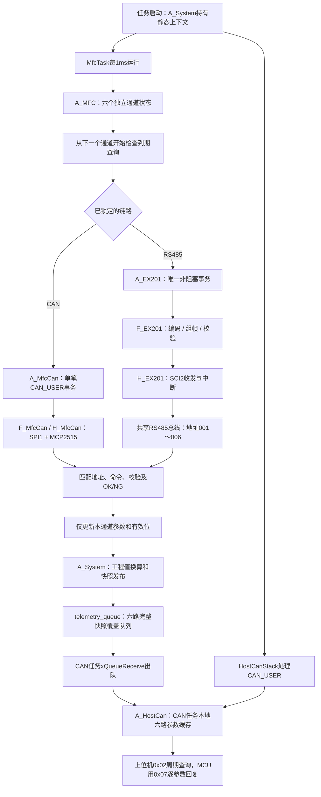

# 六路MFC轮询说明

工程版本：V1.8.0.260920。日期：2026-09-20。本文描述六路共同调度；RS485使用EX201，CAN使用本项目下行CAN_USER参数表1。新增写入链路见[流量写入执行说明](流量写入执行说明.md)。

## 1. 模块与任务



一个任务、两个候选后端、一个选中后端、一个在途请求；每次事务结束或失败后从下一个通道继续。不会为六台仪器创建六个任务，也不会同时向RS485发出六个请求。一次Process最多发起一个请求、最多扫描六个通道，无等待应答的忙循环。

A_System是板级上下文持有者，只有任务入口调用A_System_GetContext；其他业务函数仍由调用者传入上下文。MfcTask独占A_MFC、A_MfcLink、A_EX201及A_MfcCan事务。HostCanStack独占CAN收发和本地参数缓存。MfcTask按值向telemetry_queue写入六路完整快照，HostCanStack出队后更新自身缓存；任何任务不得直接访问其他任务业务上下文。

## 2. 默认参数与修改位置

| 参数 | 默认值 | 位置 / 含义 |
| --- | --- | --- |
| 六路地址 | 001、002、003、004、005、006 | A_MFC_DefaultConfig；也可在MfcTask入口覆盖g_config.addresses |
| 瞬时流量目标间隔 | 每路500ms | A_MFC_ACTUAL_PERIOD_MS |
| 慢速查询槽间隔 | 每路1000ms | A_MFC_STATUS_SLOT_MS；一个槽读一个参数 |
| 离线及硬件重试 | 5000ms | A_MFC_RETRY_MS |
| 已就绪通道离线阈值 | 连续3次事务失败 | A_MFC_FAILURE_LIMIT；任何一次成功清零 |
| 错误后静默 | 50ms | A_MFC_ERROR_GUARD_MS；需实机确认足够的迟到帧排空时间 |
| UART发送超时 | 100ms | 既有A_EX201事务层 |
| 仪器响应超时 | 500ms | 既有A_EX201事务层，从TX完成后开始 |
| 上位机实际流量过期 | 2000ms | A_HOSTCAN_DATA_MAX_AGE_MS |
| 任务推进节拍 | 1ms | MfcTask入口；当前要求FreeRTOS 1000Hz |
| 上位机查询周期 | 上位机决定 | 重复发送原CAN_USER的0x02，无新增主动上报 |

六个地址必须都在1～999内、互不重复。初始化先验证所有地址，遇到非法配置不会部分启动。默认值不是实际仪器地址的探测结果；部署时要为六台仪器分别设置匹配ID。第六路即使暂时没接设备，也会按相同规则轮询并报告离线。

所有间隔以无符号节拍差计算，支持32位时间回绕。目标间隔从请求发起时间计算，调度延后不会在空闲后补发一串历史查询。健康负载下尽量按期采集，离线设备超时仍占用共享总线，因此不承诺固定500ms内完成一次六路采集。

## 3. 每路初始化

自动识别锁定后开始业务初始化。CAN会先逐台检查0x0100标识及0x0108版本，再读取下面九项对应参数；RS485九个步骤如下，六台设备交替推进：先通道1～6各读RMFS，再通道1～6各读RDPP，依此类推。某路进入离线退避后，其他路继续。

| 顺序 | 命令 | 缓存内容 |
| --- | --- | --- |
| 1 | RMFS | 满量程尾数 |
| 2 | RDPP | 小数位 |
| 3 | RFRU | 单位 |
| 4 | RCFR | 带符号瞬时流量及采样时刻 |
| 5 | RSFD | 仪器数字设定流量 |
| 6 | RFSM | 数字 / 模拟设定来源 |
| 7 | RVSS | 数字阀门设定 |
| 8 | RCVS | 当前内部阀状态 |
| 9 | RALM | 报警位 |

每个参数仅在正确地址、正确命令、正确校验、OK状态及数据范围合法时更新有效位。九项全部成功后标为READY。在线标志在首次合法业务应答后即可置位，初始化状态与在线状态分别报告。

初始化任一步失败，该路进入FAILED、online=0并撤销所有参数有效位；退避5s后从RMFS重新读取。不会拿其他通道的量程、小数位或单位补齐缺失参数。

## 4. 周期查询与故障

READY后RCFR按每路500ms到期；慢速槽按每路1000ms到期，按以下顺序循环：

```text
RSFD → RFSM → RVSS → RCVS → RALM → RSFD → ...
```

每个慢速参数约5s更新一次。两类查询同时到期时交替优先，避免持续超时负载下只读RCFR、永远不读状态。跨通道按轮转起点扫描，失败不会在本路立即循环重试。

单次错误立即撤销本次字段的有效位，保留其他已确认字段；连续三次事务失败则撤销该路所有有效位并退避。last_error保存在A_MFC_Channel，便于无硬件调试器检查；此值是A_EX201_Result内部枚举，未擅自增加CAN地址。已失效的旧数值可以仍保留在内存，但不得作为有效结果回复。

在当前生产双后端配置中，UART或CAN恢复失败会使六路失效，并交给A_MfcLink停止旧事务后重新探测；单路离线仍按5s退避。仅使用EX201的独立测试客户端保留原5s硬件重试逻辑。重新锁定后六路重新初始化。EX201缺少事务序号，50ms静默和地址/命令匹配降低迟到帧影响，不能据此证明任意超长迟到应答都能识别；真实仪器响应上界须待硬件联调确认。

## 5. CAN参数与真实数据

A_System按本通道小数位换算：

```text
工程值 = EX201尾数 / 10^小数位
```

量程、实际流量和仪器设定均采用该通道单位；负瞬时流量保留符号。EX201有效标志与CAN有效标志位定义不同，代码逐项映射，不能直接复制位掩码。

- 0x0000～0x0005：六路实际流量。
- 0x0010～0x0015：六路仪器读回的数字设定。
- 0x0020～0x0025：六路满量程。
- 0x0102：六路在线掩码，全部在线为0x3F。
- 0x0110～0x0115：字段有效位。
- 0x0150～0x0155：实际流量数据年龄。
- 0x0160～0x0165：初始化状态，0未初始化、1进行中、2就绪、3失败。
- 0x0190～0x0195：配置的六路设备地址。

其余映射见[CAN_USER通讯与参数表](CAN_USER通讯与参数表.md)。RVSS保留在MFC缓存，当前CAN内部阀参数仍来自RCVS。未接受并执行写命令前，不把RSFD冒充为MCU目标值。

每次采集更新MFC本地对应通道，再把包含六路、link、ready的完整A_System_Telemetry通过xQueueOverwrite送入长度1队列。CAN晚启动或暂时停止消费时，队列始终保留最新六路数据；旧采样不积压，其他通道不会被单路消息覆盖。A_HostCan_PublishChannel和PublishMfcLink只由CAN任务出队后调用，Control的九阀状态通过独立valve_state_queue交接。

普通周期采集只发读取命令。流量写入与轮询共用当前后端的唯一事务；写入成功并读回一致后才发布MCU目标有效位。写流量不改变模拟/数字来源、内部阀模式或外部阀门。下行CAN_USER/MCP2515及RS485/CAN自动识别已接入，具体对应过程见末节。

## 6. 无电路验证

在仓库根目录执行：

```powershell
./tests/mfc/run.ps1
./tests/can/run.ps1
```

测试编译实际A_MFC、A_EX201、F_EX201、A_System、A_Control和CAN应用/协议/驱动代码；EX201硬件、CAN FSP外设和FreeRTOS队列使用测试替身。模拟六台独立设备，默认读取请求UART发送耗时12ms、完整响应耗时35ms；写测试另行模拟WSFD及可配置应答延迟。生产固件不包含此模拟实现。

覆盖六路初始化公平顺序、全部慢速命令多次查询、不同单位和小数位、负流量、六帧CAN回复、单路断开/重连、全部缺席、坏校验、NG、参数错误、地址不匹配、发送超时、共享硬件失败、任务先后启动及时间回绕。模拟器断言任意时刻最多存在一个在途串口请求；只读用例拒绝写命令，只有写链路用例显式启用WSFD。

无硬件时可确认软件调度和协议数据路径；实际SCI2时序、收发方向、跳线/地址、仪器响应时间、CAN电气通信和任务栈水位仍需实板验证。当前工程与源码中保留这些边界，不将测试替身响应作为硬件验证结论。

V1.6.0补充：任务业务交接统一为七个静态队列，完整定义及调用顺序见[主板运行流程与收发函数说明](主板运行流程与收发函数说明.md)。新增测试验证CAN暂停期间MFC继续采集、CAN缓存直到出队才变化、六路最新快照整体覆盖以及命令/结果队列拥塞。

V1.6.1可读性整理：任务及通信状态改为独立静态存储，初始化处明确绑定同任务模块指针；队列创建直接使用xQueueCreateStatic，关键分支展开并添加步骤注释。最新变量名和阅读顺序见[主板运行流程与收发函数说明](主板运行流程与收发函数说明.md)第12节。

## V1.8.0 双后端识别和CAN轮询

启动后`A_MFC_Process → A_MfcLink_Process`按节点1～6交替探测：RS485读取RMFS和RDPP；CAN读取设备标识0x0100和版本0x0108。两次不同的只读应答均正确才锁定整条总线，一个兼容设备即可确认链路；随后六个通道仍分别初始化。CAN使用固定节点1～6，RS485地址沿用addresses配置，默认001～006。

| RS485操作 | CAN参数 | 数据解释 |
| --- | --- | --- |
| RMFS | 0x0101 | uint32满刻度尾数 |
| RDPP | 0x0102 | uint32小数位 |
| RFRU | 0x0103 | uint32单位 |
| RCFR | 0x0000 | float32瞬时流量，转换为本通道尾数 |
| RSFD | 0x0001 | float32当前数字设定，转换为本通道尾数 |
| RFSM | 0x0104 | uint32数字/模拟来源 |
| RVSS | 0x0105 | uint32内部阀数字设定 |
| RCVS | 0x0106 | uint32内部阀状态 |
| RALM | 0x0107 | uint32报警位 |

CAN仍采用每路500ms瞬时流量目标间隔、1000ms慢速槽、连续3次失败离线及5s单路重试；实际完成周期受离线等待和总线调度影响。CAN单事务期限200ms，错误后250ms静默，SPI接收在MfcTask内轮询。单台离线不切换协议；整条链路10s无有效应答或后端恢复失败，撤销旧缓存并重新探测，旧写入不重放。

CAN每台设备独立检查标识与版本。身份正确但参数初始化失败仍不允许写入。上位机快照和八个任务间队列保持原结构，A_EX201_DeviceInfo/A_EX201_Result名称在公共缓存和错误类型中保留，以免引入无关重构。

完整协议、状态图、对端要求和限制见[MFC下行CAN_USER协议与自动识别](MFC下行CAN_USER协议与自动识别.md)。
