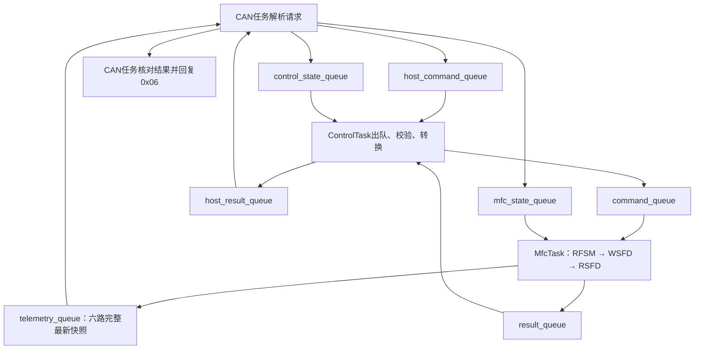

# 流量写入执行说明

工程版本：V1.6.1.260915。日期：2026-09-15。

## 1. 已实现的范围

上位机通过CAN_USER的0x01写0x0200～0x0205，MCU经RS485使用EX-201S自带协议设置对应设备的数字流量，并在读回一致后通过0x06返回执行结果。六路共用同一套业务接口，地址、单位、小数位及量程各自独立。

只改变数字设定值，不切换数字/模拟来源，不操作内部阀设定、九个外部阀门或气路。读回成功不表示实际流量已到达目标。下行CAN/MCP2515和双协议探测仍待开发。

## 2. 任务交接与数据所有权



| 队列 | 元素 | 满时行为 |
| --- | --- | --- |
| host_command_queue：CAN→Control | A_HostCan_Command | 拒绝新命令并返回BUSY |
| command_queue：Control→MFC | A_MFC_Command | 形成BUSY结果，不覆盖旧命令 |
| result_queue：MFC→Control | A_MFC_CommandResult | MFC保留DONE并继续轮询 |
| host_result_queue：Control→CAN | A_Control_Host_Result | Control保留pending_result，不接收下一笔 |
| telemetry_queue：MFC→CAN | A_System_Telemetry，六路及link/ready | 覆盖为最新完整状态 |
| control_state_queue：CAN→Control | A_Control_Host_State | 覆盖为最新请求有效状态 |
| mfc_state_queue：CAN→MFC | A_Control_Host_State | 覆盖为最新请求有效状态 |

全部长度1，FreeRTOS静态分配并按值复制。A_System_Initialize在启动临界区创建，重复调用不重建已有队列。queues_ready完成后不再改变，只用于启动资源同步；业务数据和就绪状态都通过队列。

CAN任务独占host_can，MFC独占mfc，Control独占control。CAN任务自己调用TakeCommand后入host_command_queue，自己从host_result_queue取得结果再调用CompleteCommand。Control和MFC不访问CAN命令槽或CAN缓存。MFC把完整六路快照入队后才将结果入队；CAN拿到结果时再检查快照队列，保证确认数据在成功回复前已经接收。

A_MFC_Command包含sequence、index、operation、target_flow、started_tick和timeout_ticks。A_MFC_CommandResult包含sequence、code和transport_result。CAN有效状态消息包含sequence、started_tick、updated_tick和valid。所有消息都是值副本，不传指向其他任务可变上下文的指针。
## 3. 执行状态与判定

| 状态 | 处理 |
| --- | --- |
| IDLE | 无写请求，正常六路轮询 |
| PENDING | 等当前轮询结束和错误静默期结束，再检查设备条件 |
| SOURCE | 等待RFSM响应，更新真实数字/模拟来源 |
| START | 重新校验目标、原请求及数字来源，准备发送WSFD |
| ACK | 等待WSFD的OK/NG |
| READBACK | 在原请求仍有效时发起RSFD |
| VERIFY | 等待读回并按整数尾数比较 |
| DONE | 保留结果直到成功入队；可继续普通轮询 |

每轮MfcTask先调用A_MFC_ProcessCommand，再调用A_MFC_Process。写事务使用串口期间轮询不会启动新事务；PENDING不会中断正在进行的轮询。写流程完成后恢复公平轮询。ControlTask不调用任何UART或EX201事务接口。

CAN层先检查值、在线状态、初始化及量程；MfcTask执行前再次核对自身通道状态。RFSM读取用于确认来源仍为数字，不能只依靠约5秒周期更新的旧来源缓存。重新确认失败时不发送WSFD。

## 4. 工程值与目标缓存

目标必须有限、非负、不超过满量程，设备元数据齐全、在线且初始化完成。转换采用：

```text
尾数 = 目标工程值 × 10^本通道小数位
```

尾数范围0～9999，且不得超过该仪器满量程尾数。取最近整数后，仅允许float32表达和乘法引入的误差，容差为2 × FLT_EPSILON × max(1, 尾数)。超出该误差视为目标精度超过仪器分辨率，返回0x0D。例：小数位1，12.3→0123；12.34被拒绝。

开始尝试WSFD时，撤销旧目标和旧RSFD读回的有效位，避免继续把不确定数据作为有效设定。收到OK并不立即成功；RSFD读回尾数一致后才恢复确认目标有效位，同时更新仪器读回值，并发布CAN快照。

0x0200～0x0205在本版表示MCU最近一次成功写入且读回确认的目标；0x0010～0x0015表示仪器实际读回设定。读回不一致时后者可以有效，前者保持无效。普通轮询恢复RSFD值不会恢复一个未确认的MCU目标。

## 5. 期限、取消与错误

总期限3000ms，从CAN接受请求时起算，包含命令交接、当前在途轮询和RFSM/WSFD/RSFD。每个EX201事务沿用100ms发送超时和500ms应答超时。四个可能连续的事务合计预算约2400ms，剩余时间供任务调度和交接；延迟超出总期限则取消，不延长旧请求。

上位机回复等待时间建议至少3500ms，并对超时后结果不确定的情况先查询确认。功能码和帧格式保持CAN_USER原协议，不增加线上事务号；sequence只用于MCU内部关联。

| CAN业务码 | 写执行含义 |
| --- | --- |
| 0x00 | WSFD成功且RSFD读回一致 |
| 0x06 | 有未完成请求或命令队列满 |
| 0x07 | MFC离线 |
| 0x08 | 队列/设备/数字控制条件未就绪；外部阀执行尚未接入 |
| 0x0A | 仪器返回NG |
| 0x0B | 下行发送或应答超时 |
| 0x0D | 非有限值或目标超出设备分辨率 |
| 0x0E | 负值或超过量程 |
| 0x0F | 总执行期限已到，或请求被撤销后已无执行资格 |
| 0x10 | EX201校验、地址/命令或数据格式错误 |
| 0x11 | UART驱动或恢复失败 |
| 0x12 | 写入OK后读回不一致 |

CAN任务发现超时、执行器撤销或硬件故障后，将失效状态覆盖写入两个独立状态队列。MFC用A_Control_RequestValid检查自己出队的副本：请求号和起点相同、状态年龄小于20ms、原请求年龄小于3000ms才继续。最终状态出队、检查及WSFD非阻塞启动处于短临界区，期间不等待硬件完成。CAN尚未发布的物理故障存在调度通知延迟，不能继续沿用旧版“CAN任务未处理故障也立即禁止WSFD”的直接硬件读取保证。20ms为状态有效期，超期后在MFC下次运行时退出，实际调度和临界区时长待实板验证。

取消发生在排队阶段时，不触碰当前轮询；发生在写流程的在途事务时，恢复串口并进入错误静默期。已经发送的字节或已经生效的设定无法撤回，固件不自动重发WSFD。CAN恢复后不重放旧请求；旧结果不能完成新请求。bus-off期间旧请求的回复可能因恢复而被丢弃，上位机应按通信故障处理。

ControlTask在收到对应结果前不重新领取业务请求。结果队列满时MfcTask保留DONE结果并继续轮询，等待ControlTask消费；不覆盖未消费结果，不把结果入队当作已发出CAN回复。

## 6. 无硬件验证

```powershell
./tests/mfc/run.ps1
./tests/can/run.ps1
```

mfc脚本先运行原六路轮询测试，再运行A_WriteTest。它们编译真实A_Control、A_System、A_MFC、EX201协议和CAN协议/驱动适配代码；仅外设及FreeRTOS队列使用测试替身。队列替身检查按值复制、容量限制和非阻塞参数；ARM目标构建链接实际FreeRTOS静态队列实现。

写链路测试覆盖六路分别写入与查询目标、无提前成功回复、普通轮询继续、零/满量程、分辨率、NaN/Inf/负数/超量程、数字来源变化、排队后设备失效、NG/协议/发送/驱动/读回错误、写入已生效但ACK丢失、过期命令、旧结果、新请求、bus-off在写前和写后发生、命令/结果队列满、队列初始化失败、慢应答超过1500ms及节拍回绕。模拟器仍断言总线上只有一个在途事务；只读用例不允许发出WSFD。

RA4M1 Debug编译通过，text=30108、data=2468、bss=8324字节。三任务栈仍为1024字节；已查看新增代码静态栈帧，但未实测整条调用链、中断嵌套栈水位或真实仪器、电气和气路行为。

V1.6.0新增验证：七个队列按值传输，暂停CAN时六路持续更新且CAN缓存不被跨任务修改，整组快照覆盖、两个状态消费者独立出队、CAN命令队列满、CAN结果队列满时保留结果、状态20ms过期拒绝写入和状态年龄跨回绕。

V1.6.1可读性整理：任务及通信状态改为独立静态存储，初始化处明确绑定同任务模块指针；队列创建直接使用xQueueCreateStatic，关键分支展开并添加步骤注释。最新变量名和阅读顺序见[主板运行流程与收发函数说明](主板运行流程与收发函数说明.md)第12节。
