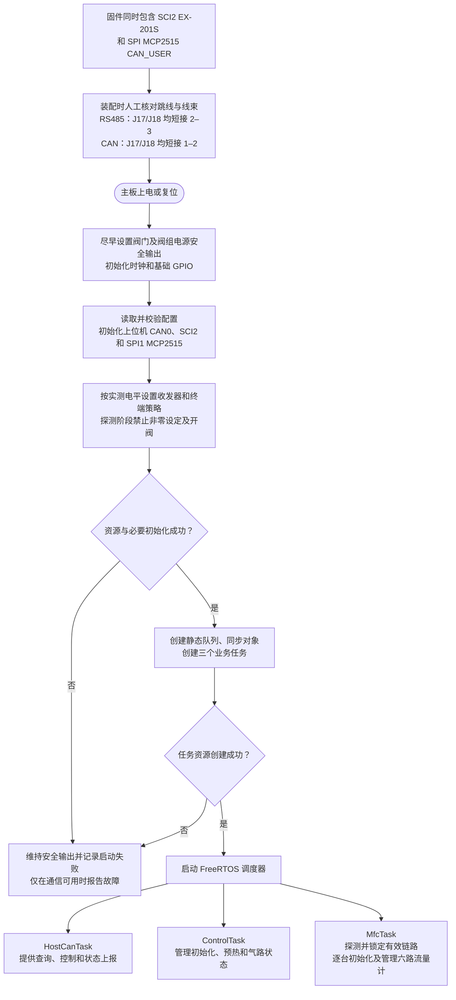
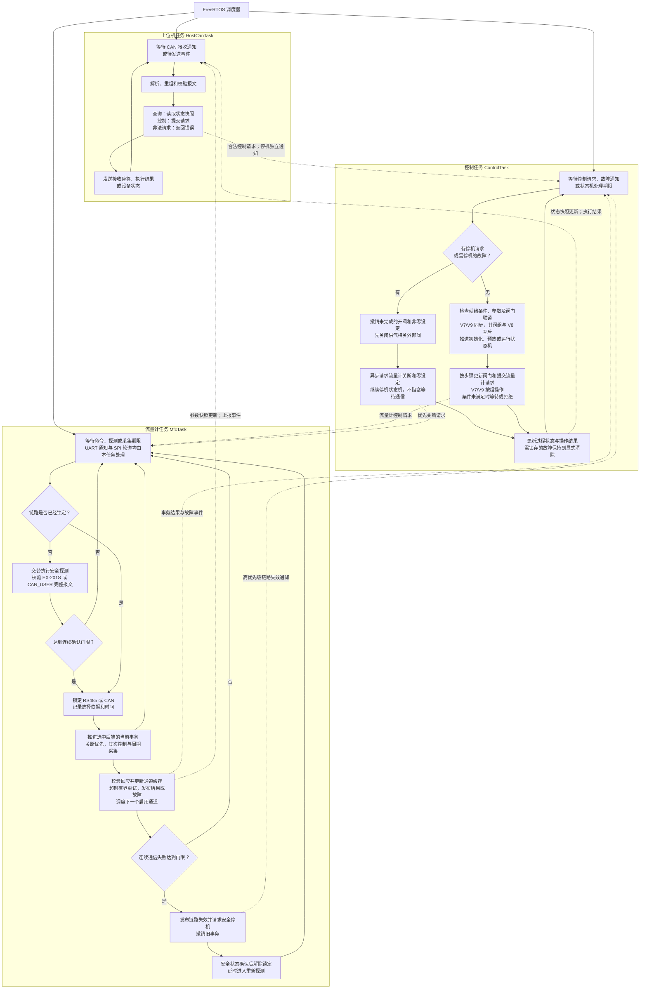
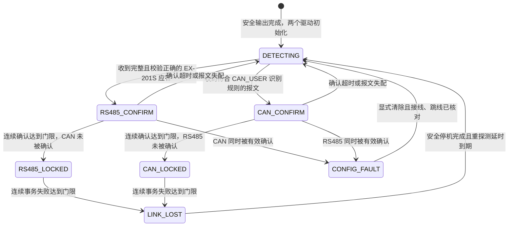
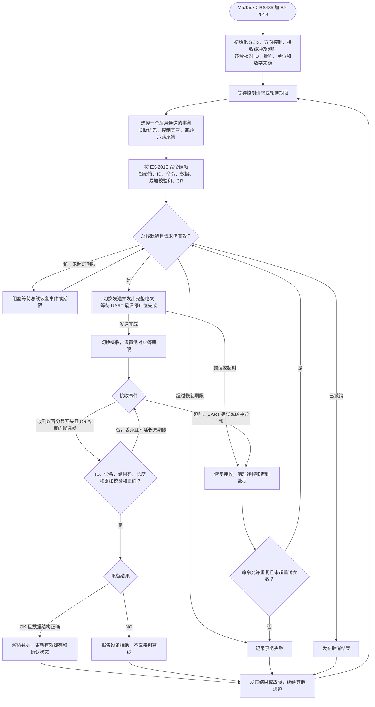
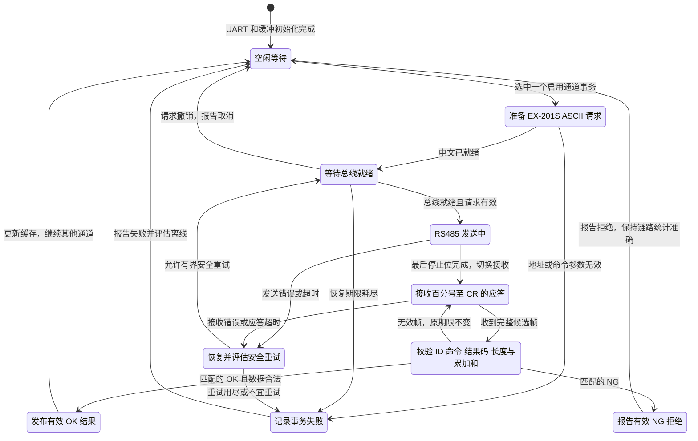
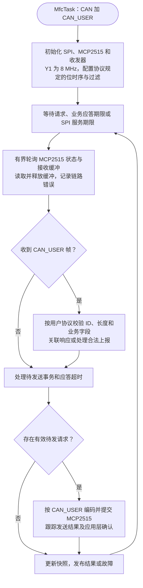
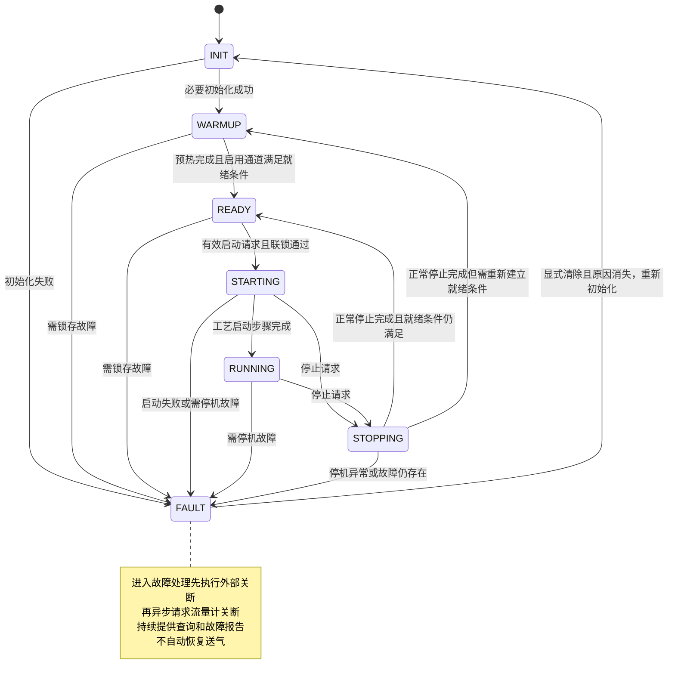
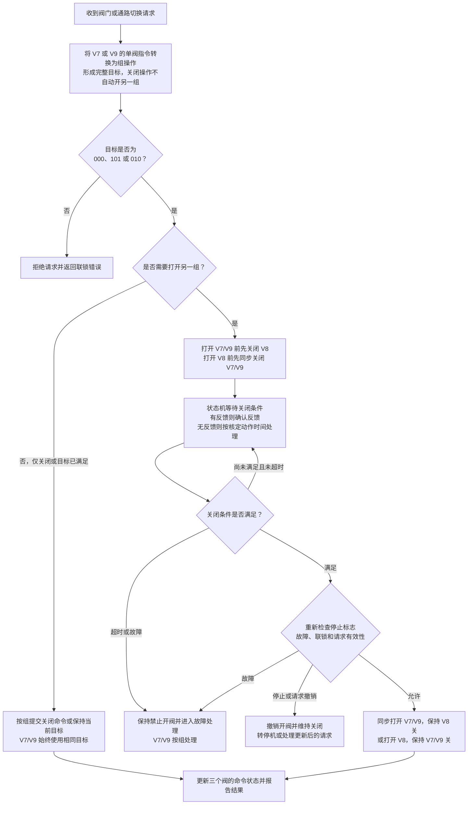

# 主板软件运行流程（FreeRTOS）

> 当前实现已更新至V1.6.0.260915：所有任务间业务数据通过七个静态FreeRTOS队列交接。实际函数、队列和收发顺序见[主板运行流程与收发函数说明](主板运行流程与收发函数说明.md)。下文保留V1.2.0初步设计，其中双后端探测及完整气路控制尚未全部实现。

版本：V1.2.0.260911。日期：2026-09-11。依据：[README.md](../../README.md) 中的硬件结论及最新通信方案。本文是初步流程设计，尚未进行完整固件实现或实板时序验证。

上位机固定使用 MCU 内置 CAN0，J1/J2 共用 U5；流量计侧固件同时包含 SCI2 + EX-201S ASCII 和 SPI + MCP2515 + CAN_USER 两个后端，由 MfcTask 在运行时探测有效协议并锁定其中一个。RS485 链路中 MCU 为主站，六台流量计为从站。J9/J15/J10 共用一条流量计总线，外部接线三选一，不创建三个端口任务。上下两条总线独立。

第 3 节定义 **运行时链路探测、RS485 EX-201S 通信状态图和 CAN_USER 流程**。第 4 节的 INIT/RUNNING/FAULT 等仍描述整机过程状态；通信和整机状态机同时工作，由请求和结果事件联系。

最新阀门规则：**V7、V9 同步开关，作为一个逻辑阀组与 V8 互斥**；第 4 节通路切换图已按此规则更新。

## 1. 运行时识别与上电初始化

实板没有 J17/J18 状态读取信号，固件不能直接读取跳线位置，也不能用软件改变跳线连接。但可以根据经过完整协议校验的 EX-201S 应答或 CAN_USER 报文识别当前可用链路。两个驱动在同一固件中初始化，探测阶段仅发送无副作用的读取或识别请求；确认链路后保持锁定，运行中不因单个异常报文切换。CAN_USER 的识别字段、波特率和确认规则需在协议中冻结。



收发器有效电平须按实板核对结果封装在驱动层，不在流程图中直接指定 MFC_EN2 为高或低。链路探测、流量计在线等待及预热均在调度器启动后进行，不能在启动任务之前阻塞等待设备。J17/J18 必须人工设置一致；若两个协议同时被确认或控制电路无法建立安全探测条件，系统进入配置故障并保持安全输出。

## 2. 三个任务的运行流程

实线表示任务内部执行顺序；虚线表示任务间请求、结果或通知。三个任务独立调度，图中的回环代表再次等待事件或期限，不代表持续空转。



任务职责和约束：

| 任务 | 建议相对优先级 | 约束 |
| --- | --- | --- |
| ControlTask | 高 | 唯一写入 V1–V9 及相关阀组控制输出的业务任务；不等待串口或 CAN 事务完成 |
| MfcTask | 中高 | 同时拥有 SCI2 与 SPI1/MCP2515，启动后探测并锁定 EX-201S 或 CAN_USER；一个任务管理六个通道对象；单次处理有界并阻塞等待，避免饿死上位机任务 |
| HostCanTask | 中 | 固定使用上位机 CAN；区分“请求已接收”与“执行已完成”，不直接操作阀门 GPIO |

六通道可以启用或禁用；第六路预留未启用时不参与必要在线条件。两个后端同时存在于固件中，但锁定后只有一个进入业务事务状态。重新探测只允许在安全停机并撤销旧事务后进行，不能按单帧到达顺序反复切换。

## 3. EX-201S 与 CAN_USER 通信流程

### 3.1 运行时链路探测与锁定



RS485 通常不会主动上报，因此探测不能只被动等待。MfcTask 先监听和轮询 MCP2515，再按地址向 EX-201S 发送只读查询，并在两种探测之间留出明确期限。RS485 只有在起始符、ID、命令、结果码、长度、累加校验和及 CR 均有效时计一次确认；CAN 只有在 ID、DLC、节点和 CAN_USER 识别字段均有效时计一次确认。建议连续两次确认后锁定，具体次数和超时由联调确定。

探测时不得设置非零流量、切换内部阀或打开外部阀。未选收发器虽然由跳线与连接器隔离，仍需验证 MFC_EN2 对 U17 DE 和 U22 STB 的联动不会造成冲突。收到两边有效协议、J17/J18 不一致或无法建立确定链路时，报告配置故障，不采用“先到先得”。

### 3.2 RS485 数据路径与电文

`ControlTask → MfcTask → EX-201S ASCII 编解码 → SCI2 → U21 → U17 → J17/J18 → J9/J15/J10 → 六台 EX-201S`。

J17/J18 均短接 2–3。两个 RJ45 和一个 DB9 共用一条总线，外部接线三选一。MCU 是唯一请求发起方，每次请求只寻址一台设备；001–006 是拟定三位 ASCII ID，实机地址必须逐台核对。

标准串口为 **9600 bit/s、8N1**，有 OPTION 选件标识时按实际选件设置。通信协议依据厂家《EX201 说明书485通讯》MJ400320A1 的 PDF 第 6–18 页：

```text
请求：@ + ID(3字符) + 命令(4字符) + 数据 + 校验和(2字符) + CR
应答：% + ID(3字符) + 命令(4字符) + OK/NG + 数据 + 校验和(2字符) + CR
```

校验和是起始字符至数据末尾全部字节之和的低 8 位，再编码成两位十六进制 ASCII，不包含校验字段及 CR。`CR` 是单字节 `0x0D`，不是可见字符串。例如 `@001WVSS155<CR>` 中数据为 `1`，校验和为 `55`；`%001RVSSOK1CF<CR>` 的校验和为 `CF`。

### 3.3 RS485 任务流程



### 3.4 RS485 通信状态图



### 3.5 EX-201S 命令及实现边界

| 业务 | 命令 | 处理要求 |
| --- | --- | --- |
| 量程、小数位、单位 | RMFS / RDPP / RFRU | 初始化读取；流量等于尾数乘以 10 的负小数位次方 |
| 数字控制来源 | RFSM / WFSM | 0 数字、1 模拟；按允许条件设置并读回 |
| 实时流量 | RCFR | 按符号、小数位与单位解码，保存采样时间 |
| 数字设定值 | RSFD / WSFD | 四位十进制尾数，检查量程；写后确认，必要时读回 |
| 当前设定 | RCFS | 与数字 SP0 区分，结合控制来源核对 |
| 内部阀命令 | RVSS / WVSS | 0 全开、1 调节控制、2 全关；不可把全开当作正常调节 |
| 内部阀状态、开度 | RCVS / RCVO | 与外部 V1–V9 的命令状态分开记录 |
| 设备报警 | RALM | 0 正常；1 传感器，2 阀门过热，4 设定记忆回路，组合值相加 |

- 本项目不使用 Modbus。接收以起始字符和 CR 确定帧边界，不使用 CRC16 或 RTU 的 t1.5/t3.5 判帧。
- UART 发送缓冲空不等于最后停止位完成，必须等待真正发送结束后转接收。应答期限、最大帧长和残帧恢复均有界，超时值依据实机响应能力确定。
- 有效 NG 表示设备拒绝本次操作，不能直接判离线；NG 具体原因若报文未提供，不得编造错误码。只有匹配且校验通过、数据结构正确的 OK 才更新相应业务值。
- 写应答丢失时设备可能已经执行。按命令的幂等性决定先读回还是重试；禁止重复执行未确认可重复的配置操作。
- 协议没有线上事务序号；同地址同命令的迟到应答可能与新事务混淆。超时后按设备最大响应时间留恢复窗口，内部请求号仅用于阻止旧结果推进新的过程。
- 手册存在 ID 范围 01–99 与 001–009、RCFR 数据长度、写指令“响应：无”与通用 OK/NG 格式的歧义，联调时逐项向厂家或实机确认。
- 模拟强制阀输入可能优先于数字设定，必须核对接线和数字控制权。停机先由 ControlTask 关闭外部供气阀，再由 MfcTask 调度内部关闭和零设定。

### 3.6 CAN_USER 任务流程

CAN_USER 是用户自定义的 MFC 应用协议。物理路径为 `MfcTask → CAN_USER → SPI → MCP2515 → U23 → U22 → 共享连接器 → CAN_USER 对端`。J17/J18 均短接 1–2。名称与后端已确认；CAN ID、节点、命令码、数据格式、确认和错误规则仍需用户协议定义。



MCP2515 INT 未接 MCU，必须由 SPI 轮询服务接收缓冲，服务期限独立于六路参数采集周期。经典 CAN 单帧数据最多 8 字节，超长业务若需分段，必须定义序号、完整性及重组超时。硬件 ACK 与发送完成仅代表 CAN 链路结果，设备执行须以 CAN_USER 应用层确认或规定的状态读回为准。

用户协议附件需要覆盖节点与六通道映射、波特率、标准/扩展 ID、命令/回应/上报、数据类型/单位/字序、错误码、心跳、事务匹配、重复写语义及恢复。CAN_USER 对端需实现同一约定；不能从 EX-201S 的 RS485 手册推断其原生支持此 CAN 协议。上位机 CAN0 的协议独立定义，不因下行采用 CAN_USER 就自动合并两侧协议或任务。


## 4. 整机控制状态与联锁

本节描述气路过程；上节描述链路探测及两种通信状态。比如整机处于 RUNNING 时，MfcTask 仍不断经历发送、接收、校验等通信状态。两者不是前后顺序执行的同一套状态机。



任意状态都保留停机处理入口。INIT/WARMUP/READY 收到停止请求时撤销操作、维持安全输出，不跳过初始化或预热；FAULT 中重复停止保持故障处理。状态图仅展示主要转换，不把普通单通道超时一律视为全机停机，具体处置由启用通道、过程状态和故障等级决定。

V7/V9 合并为逻辑阀组，目标始终同开同关；该组与 V8 互斥。按 `(V7,V8,V9)` 排列，只允许 `000`（全关）、`101`（V7/V9 开）和 `010`（V8 开），其余目标均拒绝。

上位机打开或关闭 V7、V9 中任意一个，ControlTask 都转换成对应的组操作。关闭一组只关闭该组，不自动开启另一组；打开一组则先关闭互斥组。完整批量目标若指定 V7/V9 不一致或两组同时打开，应直接返回联锁错误。



互斥组切换经过全关中间目标：`101 → 000 → 010` 或 `010 → 000 → 101`。关闭 V7/V9 阀组时必须同时撤销该组未完成的开命令。等待关闭条件由状态机期限驱动，ControlTask 在等待期间仍处理停止与故障。

关闭 V7/V9 后，必须以两阀都满足关闭条件为打开 V8 的前提；关闭 V8 后，才允许下发 V7/V9 同步开命令。目标已满足时只返回对应的命令状态，不据此宣称实际阀已到位。没有位置反馈时，只能报告命令状态和计时结果；V7/V9 的机械同步程度、具体动作时间及排空策略仍待工艺与实板确认。

## 5. 中断、超时与故障处理

- 上位机 CAN0：接收中断记录报文并通知 HostCanTask，错误和 bus-off 事件按协议策略上报及恢复。
- RS485 链路：UART 通知 MfcTask 数据与发送完成，接收至 CR 并按绝对应答期限推进第 3 节状态机；最后一个停止位发送结束后再按经实测确认的电平转接收。
- CAN_USER 链路：原理图未将 MCP2515 INT 接入 MCU，所以 MfcTask 用 SPI 轮询接收和错误状态；轮询期限独立于六路参数采集期限，不能只在慢速采集时读一次 CAN 接收缓冲。
- 自动识别：探测和锁定均由 MfcTask 执行。单个字节、未完成的 UART 帧、任意 CAN 帧及校验失败报文都不能改变链路；解除锁定前必须先完成安全停机。
- 关键停止和故障采用锁存标志或独立通知，不能被普通采集队列挤掉；停止后清除旧开阀/非零设定请求，并使用请求编号或代次避免迟到结果重新触发启动。
- 设备通信等待都有期限，重试有上限；单台掉线不能无限占用总线。收到正常应答之后才更新该设备的确认状态，超时后将旧数据标为无效或过期。
- 看门狗统一检查三个关键任务的心跳与期限健康状态。正常无业务时阻塞等待属于健康状态，不以忙循环次数作为健康标准。
- 上位机失联后的停止时限、MFC 掉线的停机等级、队列容量、任务周期及栈大小尚未定值，需依据实际协议负载与允许控制延迟确定。

## 6. 当前适用范围

当前固件同时包含 MFC RS485 的 EX-201S 协议和 MFC CAN 的 CAN_USER 协议，由 MfcTask 在运行时探测、确认并锁定有效链路。连接器、跳线及三任务结构不变，跳线仍须人工设置一致。EX-201S 按厂家手册实现并核对 OPTION 与指令歧义；CAN_USER 按用户报文字段和兼容对端实现。MFC_EN2 电平、双后端探测安全性、A/B 装配、SPI 复用及阀门时序仍需实板验证。流程图为软件设计，不代表已经实现或完成测试。

## 7. 修订记录

| 日期 | 内容 |
| --- | --- |
| 2026-09-10 | 建立三任务总体流程、整机状态与九阀联锁流程 |
| 2026-09-11 | 按用户确认更新为 RS485 + Modbus RTU；新增 RS485 任务流程和通信状态图；区分整机状态与通信状态，补充 CRC、帧计时、异常响应及有界重试 |
| 2026-09-11 | 将阀门逻辑更新为 V7/V9 同开同关、其阀组与 V8 互斥；修订合法目标、单阀指令组操作语义及先关后开的切换流程 |
| 2026-09-11 | V1.1.2.260911：纠正此前协议，当前使用 EX-201S / CAN_USER；重写 RS485 电文及状态图、新增 CAN_USER 流程；此前 Modbus 记录仅为历史。 |
| 2026-09-11 | V1.2.0.260911：取消 MFC 后端预编译选择，改为同一固件运行时探测 EX-201S 或 CAN_USER；连续确认后锁定，链路失效时先安全停机再重新探测。 |
