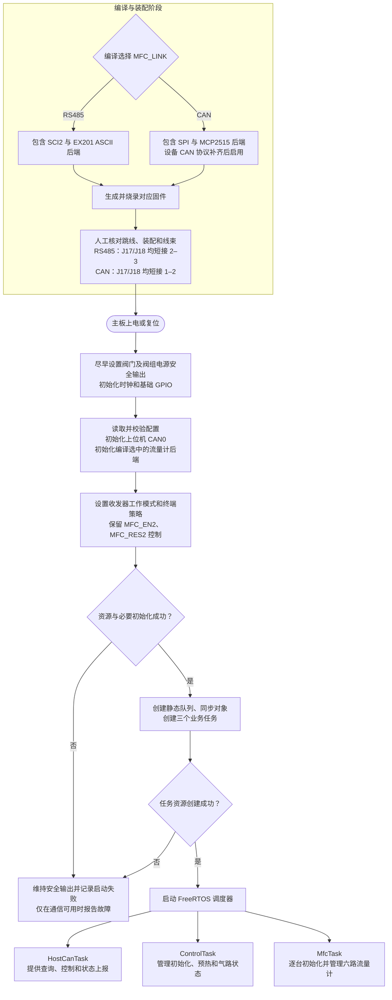
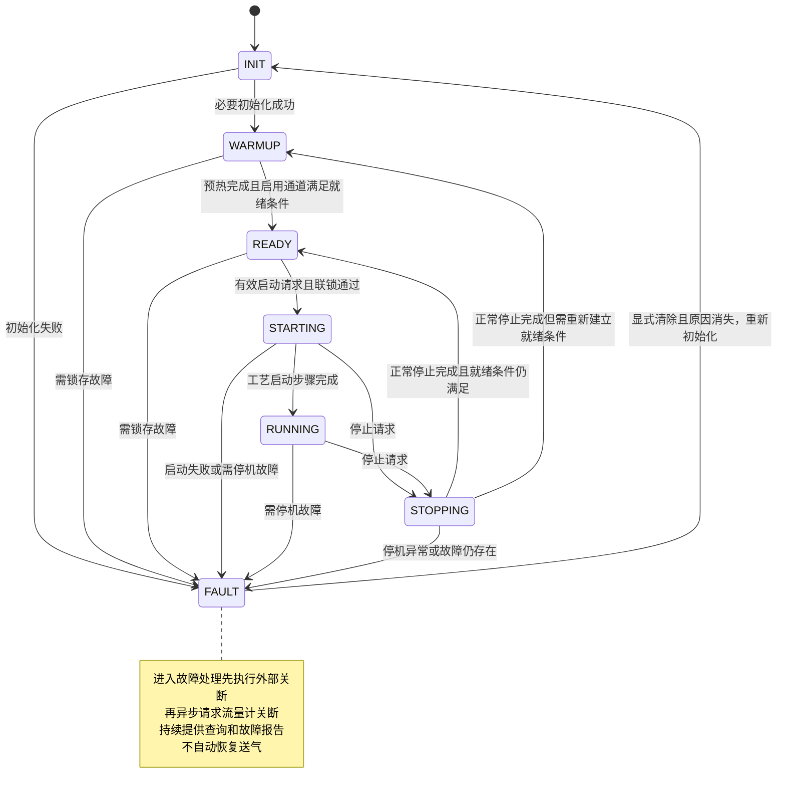
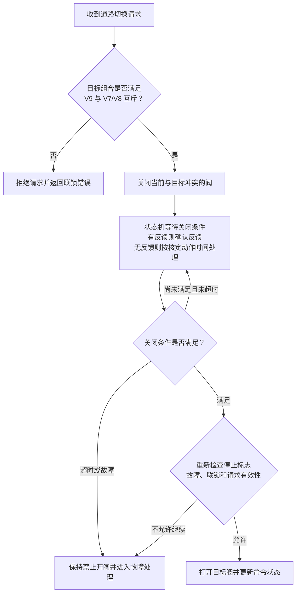

# 主板软件运行流程（FreeRTOS）

版本日期：2026-09-10。依据：[READ.md](../../READ.md) 中的硬件核对结论。本文是初步流程设计，尚未进行固件实现或实板时序验证。

上位机固定使用 MCU 内置 CAN0，J1/J2 共用 U5；流量计编译时选择 RS485 或 SPI + MCP2515 CAN。J9/J15/J10 共用一条流量计总线，外部接线三选一，不创建三个端口任务。上下两条总线独立。

## 1. 编译配置与上电初始化

图中二选一发生在编译阶段。实板没有跳线状态检测，运行时不自动识别 J17/J18，也不切换通信方式。CAN 流量计版本须在取得对应设备协议并实现适配后才能启用。

收发器有效电平须按实板核对结果封装在驱动层，不在流程图中直接指定 MFC_EN2 为高或低。流量计在线等待及预热均在调度器启动后进行，不能在启动任务之前阻塞等待设备。

## 2. 三个任务的运行流程

实线表示任务内部执行顺序；虚线表示任务间请求、结果或通知。三个任务独立调度，图中的回环代表再次等待事件或期限，不代表持续空转。

```mermaid
flowchart TB
    R[FreeRTOS 调度器] --> H0
    R --> C0
    R --> M0

    subgraph HOST[上位机任务 HostCanTask]
        direction TB
        H0[等待 CAN 接收通知<br/>或待发送事件]
        H0 --> H1[解析、重组和校验报文]
        H1 --> H2[查询：读取状态快照<br/>控制：提交请求<br/>非法请求：返回错误]
        H2 --> H3[发送接收应答、执行结果<br/>或设备状态]
        H3 --> H0
    end

    subgraph CONTROL[控制任务 ControlTask]
        direction TB
        C0[等待控制请求、故障通知<br/>或状态机处理期限]
        C0 --> C1{有停机请求<br/>或需停机的故障？}
        C1 -->|有| C2[撤销未完成的开阀和非零设定<br/>先关闭供气相关外部阀]
        C2 --> C3[异步请求流量计关断和零设定<br/>继续停机状态机，不阻塞等待通信]
        C1 -->|无| C4[检查就绪条件、参数及阀门联锁<br/>推进初始化、预热或运行状态机]
        C4 --> C5[按步骤更新阀门和提交流量计请求<br/>条件未满足时等待或拒绝]
        C3 --> C6[更新过程状态与操作结果<br/>需锁存的故障保持到显式清除]
        C5 --> C6
        C6 --> C0
    end

    subgraph MFC[流量计任务 MfcTask]
        direction TB
        M0[等待命令、采集期限<br/>或 CAN 版本的 SPI 轮询期限]
        M0 --> M1[推进当前事务<br/>关断优先，其次控制与周期采集]
        M1 --> M2[仅使用编译选中的后端<br/>RS485：UART 通知与超时<br/>CAN：SPI 读取 MCP2515 状态]
        M2 --> M3[校验回应并更新通道缓存<br/>超时有界重试，发布结果或故障<br/>调度下一个启用通道]
        M3 --> M0
    end

    H2 -. 合法控制请求；停机独立通知 .-> C0
    C5 -. 流量计控制请求 .-> M0
    C3 -. 优先关断请求 .-> M0
    M3 -. 事务结果与故障事件 .-> C0
    M3 -. 参数快照更新；上报事件 .-> H0
    C6 -. 状态快照更新；执行结果 .-> H0
```

任务职责和约束：

| 任务 | 建议相对优先级 | 约束 |
| --- | --- | --- |
| ControlTask | 高 | 唯一写入 V1–V9 及相关阀组控制输出的业务任务；不等待串口或 CAN 事务完成 |
| MfcTask | 中高 | 一个任务管理六个通道对象；单次处理有界，主动阻塞或让出，避免饿死上位机任务 |
| HostCanTask | 中 | 固定使用上位机 CAN；区分“请求已接收”与“执行已完成”，不直接操作阀门 GPIO |

六通道可以启用或禁用；第六路预留未启用时不参与必要在线条件。MfcTask 的两个后端在运行时只存在一个。图中双后端文字用于说明两种编译版本，不表示运行时切换。

## 3. 控制状态与联锁

任意状态都保留停机处理入口。INIT/WARMUP/READY 收到停止请求时撤销操作、维持安全输出，不跳过初始化或预热；FAULT 中重复停止保持故障处理。状态图仅展示主要转换，不把普通单通道超时一律视为全机停机，具体处置由启用通道、过程状态和故障等级决定。

V7/V8/V9 的目标组合先校验：V9 与 V7、V8 中任意一个均不能同时打开；V7 与 V8 可以同时打开，但还需满足工艺模式要求。

等待关闭条件由状态机期限驱动，ControlTask 在等待期间仍处理停止与故障。没有位置反馈时，只能报告阀门命令状态和计时结果，不能宣称已测得阀门物理到位。具体开阀顺序、排空策略和动作时间待工艺确认。

## 4. 中断、超时与故障处理

- 上位机 CAN0：接收中断记录报文并通知 HostCanTask，错误和 bus-off 事件按协议策略上报及恢复。
- RS485 版本：UART 通知 MfcTask 数据与发送完成；最后一个停止位发送结束后再按经实测确认的电平转接收。
- CAN 流量计版本：原理图未将 MCP2515 INT 接入 MCU，所以 MfcTask 用 SPI 轮询接收和错误状态；轮询期限独立于六路参数采集期限，不能只在慢速采集时读一次 CAN 接收缓冲。
- 关键停止和故障采用锁存标志或独立通知，不能被普通采集队列挤掉；停止后清除旧开阀/非零设定请求，并使用请求编号或代次避免迟到结果重新触发启动。
- 设备通信等待都有期限，重试有上限；单台掉线不能无限占用总线。收到正常应答之后才更新该设备的确认状态，超时后将旧数据标为无效或过期。
- 看门狗统一检查三个关键任务的心跳与期限健康状态。正常无业务时阻塞等待属于健康状态，不以忙循环次数作为健康标准。
- 上位机失联后的停止时限、MFC 掉线的停机等级、队列容量、任务周期及栈大小尚未定值，需依据实际协议负载与允许控制延迟确定。

## 5. 当前适用范围

RS485 + EX201 ASCII 为现有资料支持的开发基线。CAN 流量计分支是硬件支持下的预留软件方案，设备协议仍待确认。MFC_EN2 光耦输出门限、A/B 电阻装配、SPI 管脚复用及阀门安全电平等未确认项详见 READ.md；流程图没有将这些项目视为已完成实板验证。
