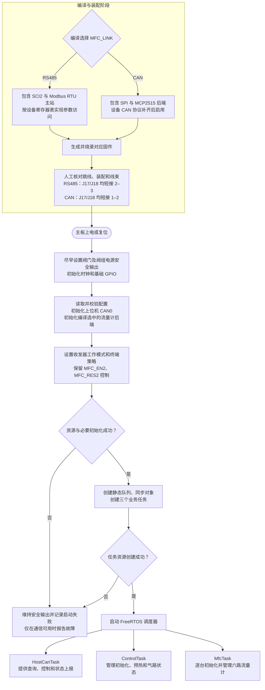
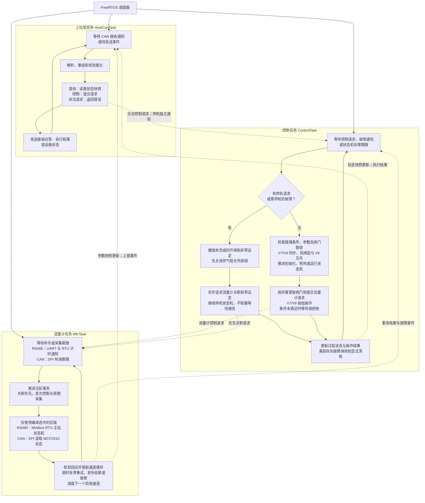
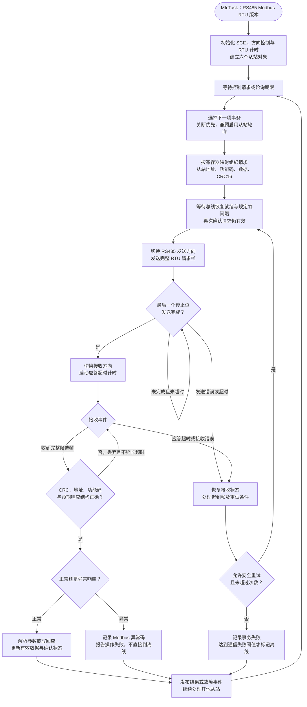
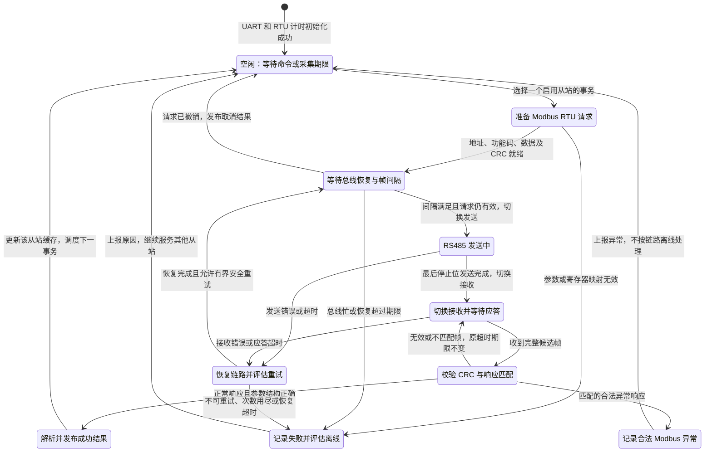
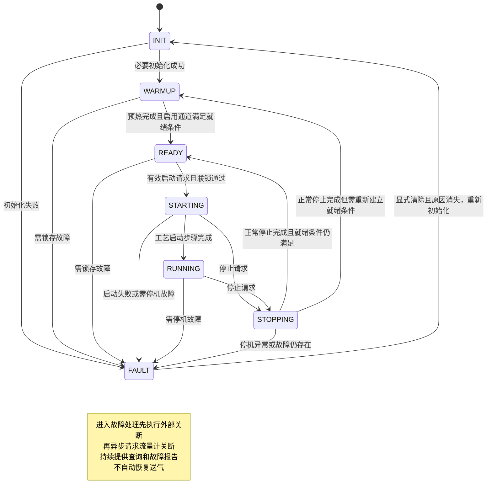
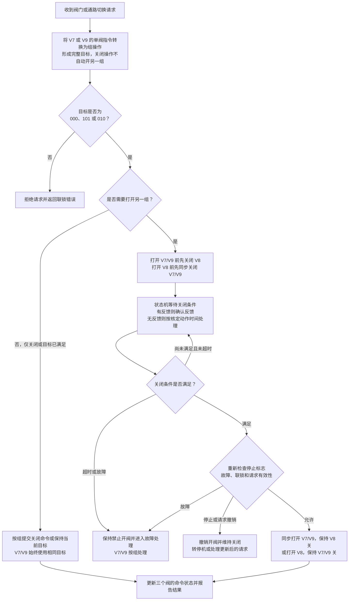

# 主板软件运行流程（FreeRTOS）

版本日期：2026-09-11。依据：[READ.md](../../READ.md) 中的硬件核对结论及用户对 Modbus RTU 的确认。本文是初步流程设计，尚未进行固件实现或实板时序验证。

上位机固定使用 MCU 内置 CAN0，J1/J2 共用 U5；流量计编译时选择 RS485 + Modbus RTU 或 SPI + MCP2515 CAN。RS485 版本中 MCU 为主站，六台流量计为从站。J9/J15/J10 共用一条流量计总线，外部接线三选一，不创建三个端口任务。上下两条总线独立。

本次新增第 3 节：**RS485 Modbus RTU 通信流程与通信状态图**。第 4 节的 INIT/RUNNING/FAULT 等仍描述整机过程状态；两套状态机同时工作，由请求和结果事件联系，RS485 不作为整机的一个运行模式状态。

最新阀门规则：**V7、V9 同步开关，作为一个逻辑阀组与 V8 互斥**；第 4 节通路切换图已按此规则更新。

## 1. 编译配置与上电初始化

图中二选一发生在编译阶段。实板没有跳线状态检测，运行时不自动识别 J17/J18，也不切换通信方式。CAN 流量计版本须在取得对应设备协议并实现适配后才能启用。



收发器有效电平须按实板核对结果封装在驱动层，不在流程图中直接指定 MFC_EN2 为高或低。流量计在线等待及预热均在调度器启动后进行，不能在启动任务之前阻塞等待设备。

## 2. 三个任务的运行流程

实线表示任务内部执行顺序；虚线表示任务间请求、结果或通知。三个任务独立调度，图中的回环代表再次等待事件或期限，不代表持续空转。



任务职责和约束：

| 任务 | 建议相对优先级 | 约束 |
| --- | --- | --- |
| ControlTask | 高 | 唯一写入 V1–V9 及相关阀组控制输出的业务任务；不等待串口或 CAN 事务完成 |
| MfcTask | 中高 | RS485 版本执行 Modbus RTU 主站状态机，一个任务管理六个从站对象；单次处理有界并阻塞等待，避免饿死上位机任务 |
| HostCanTask | 中 | 固定使用上位机 CAN；区分“请求已接收”与“执行已完成”，不直接操作阀门 GPIO |

六通道可以启用或禁用；第六路预留未启用时不参与必要在线条件。MfcTask 的两个后端在运行时只存在一个。图中双后端文字用于说明两种编译版本，不表示运行时切换。

## 3. RS485 Modbus RTU 通信流程与状态图

### 3.1 RS485 版本的数据路径

```text
上位机 --CAN--> HostCanTask --控制请求--> ControlTask
                                             |
                                  流量设定 / 关断请求
                                             v
                         MfcTask：Modbus RTU 主站
                                             |
                        SCI2 UART + U17 RS485 收发器
                                             |
               J17/J18 均短接 2–3，J9/J15/J10 接线三选一
                                             |
                         六台 Modbus RTU 从站，共用总线
```

采集结果进入六通道缓存，执行结果与通信异常通知 ControlTask，上位机通过 HostCanTask 查询或接收上报。上位机不直接成为这条 RS485 总线上的第二个主站。

### 3.2 RS485 任务流程图

图中采用单播事务，六台建议地址为数值 1–6，实际地址待设备配置确认。流量读取、设定、内部阀关闭等均通过厂家规定的功能码和寄存器/线圈地址完成。



“等待”由通知和定时器驱动，不是空转循环。帧间隔等待、总线持续忙、发送、接收及恢复都设置期限，任何一个从站都不能永久阻塞其他从站。发送前发现请求已撤销时直接发布取消结果、返回调度，不发送过期设定。

### 3.3 RS485 通信状态图



FAILED 是“当前事务失败”，不是“整个 MfcTask 停止”。配置错误、合法异常与链路失联分开统计；离线阈值只依据对应的通信失败策略判断。离线从站降低探测频率，恢复后重新核对配置并更新在线状态，不自动重新送气。

### 3.4 RTU 时序与实现边界

- 帧间隔采用 t3.5，帧内字符间隔采用 t1.5；波特率不高于 19200 bit/s 时按字符时间计算，高于该速率时规范推荐分别使用 1.75 ms 和 750 μs。应答超时是另一项由设备响应能力确定的期限，不能拿 t3.5 当应答超时。
- 使用硬件计时或足够精确的接收时间戳捕获帧界限。不能假定 UART 的单字符 IDLE 事件就是 RTU 帧结束，也不能用普通 FreeRTOS 延时保证亚毫秒间隔。
- 正常帧需校验从站地址、功能码、字节数/写回内容和 CRC16；CRC 低字节先发。RTU 不使用旧 EX201 专用 ASCII 帧头和 CR 结束符。
- 单播事务同一时刻只保留一个在途请求。本版本不使用广播控制，所以每项操作都有应答或超时出口。规则依据 [Modbus 串行规范 V1.02](https://www.modbus.org/file/secure/modbusoverserial.pdf)。
- 合法异常回应仍说明设备作出了响应，应报告异常码；非法地址/功能等错误不盲目重试。需要延迟重试的设备忙等异常可按厂家规定另行入队，本图默认先报告本次异常。异常机制依据 [Modbus 应用协议 V1.1b3](https://www.modbus.org/file/secure/modbusprotocolspecification.pdf)。
- 自动重试仅限确认可以重复执行的操作。写请求丢失应答时设备可能已经执行；是否重发或先读回取决于设备寄存器语义。
- RTU 没有线上事务编号。超时恢复应结合设备最大响应时间清理迟到数据并留出恢复窗口；不能仅靠任务内部请求编号区分两个结构相同的迟到响应。
- 停机立即通知 ControlTask 处理外部阀，并取消排队中的旧开阀/非零设定。MfcTask 在完整发送帧边界和有限事务期限内优先调度关断；迟到写回应不能重新触发启动。
- 通信任务在整机 INIT、WARMUP、READY、RUNNING、STOPPING、FAULT 等状态均保持事件处理能力，具体允许的写操作由 ControlTask 的状态与联锁决定。

## 4. 整机控制状态与联锁

本节描述气路过程；上节描述 RS485 通信。比如整机处于 RUNNING 时，MfcTask 仍不断经历发送、接收、校验等通信状态。两者不是前后顺序执行的同一套状态机。



任意状态都保留停机处理入口。INIT/WARMUP/READY 收到停止请求时撤销操作、维持安全输出，不跳过初始化或预热；FAULT 中重复停止保持故障处理。状态图仅展示主要转换，不把普通单通道超时一律视为全机停机，具体处置由启用通道、过程状态和故障等级决定。

V7/V9 合并为逻辑阀组，目标始终同开同关；该组与 V8 互斥。按 `(V7,V8,V9)` 排列，只允许 `000`（全关）、`101`（V7/V9 开）和 `010`（V8 开），其余目标均拒绝。

上位机打开或关闭 V7、V9 中任意一个，ControlTask 都转换成对应的组操作。关闭一组只关闭该组，不自动开启另一组；打开一组则先关闭互斥组。完整批量目标若指定 V7/V9 不一致或两组同时打开，应直接返回联锁错误。



互斥组切换经过全关中间目标：`101 → 000 → 010` 或 `010 → 000 → 101`。关闭 V7/V9 阀组时必须同时撤销该组未完成的开命令。等待关闭条件由状态机期限驱动，ControlTask 在等待期间仍处理停止与故障。

关闭 V7/V9 后，必须以两阀都满足关闭条件为打开 V8 的前提；关闭 V8 后，才允许下发 V7/V9 同步开命令。目标已满足时只返回对应的命令状态，不据此宣称实际阀已到位。没有位置反馈时，只能报告命令状态和计时结果；V7/V9 的机械同步程度、具体动作时间及排空策略仍待工艺与实板确认。

## 5. 中断、超时与故障处理

- 上位机 CAN0：接收中断记录报文并通知 HostCanTask，错误和 bus-off 事件按协议策略上报及恢复。
- RS485 Modbus RTU 版本：UART 通知 MfcTask 数据与发送完成，配合 RTU 帧计时推进第 3 节状态机；最后一个停止位发送结束后再按经实测确认的电平转接收。
- CAN 流量计版本：原理图未将 MCP2515 INT 接入 MCU，所以 MfcTask 用 SPI 轮询接收和错误状态；轮询期限独立于六路参数采集期限，不能只在慢速采集时读一次 CAN 接收缓冲。
- 关键停止和故障采用锁存标志或独立通知，不能被普通采集队列挤掉；停止后清除旧开阀/非零设定请求，并使用请求编号或代次避免迟到结果重新触发启动。
- 设备通信等待都有期限，重试有上限；单台掉线不能无限占用总线。收到正常应答之后才更新该设备的确认状态，超时后将旧数据标为无效或过期。
- 看门狗统一检查三个关键任务的心跳与期限健康状态。正常无业务时阻塞等待属于健康状态，不以忙循环次数作为健康标准。
- 上位机失联后的停止时限、MFC 掉线的停机等级、队列容量、任务周期及栈大小尚未定值，需依据实际协议负载与允许控制延迟确定。

## 6. 当前适用范围

用户已确认 RS485 使用 Modbus RTU，本次已替换原先专用 ASCII 方案。波特率、校验/停止位、实际从站地址、功能码、寄存器表、数据类型与缩放、最大响应时间待实际设备资料补齐，不预填推测值。CAN 流量计分支仍为协议待确认的预留方案。MFC_EN2 光耦输出门限、A/B 电阻装配、SPI 管脚复用及阀门安全电平等未确认项详见 READ.md；流程图不代表已完成实板验证。

## 7. 修订记录

| 日期 | 内容 |
| --- | --- |
| 2026-09-10 | 建立三任务总体流程、整机状态与九阀联锁流程 |
| 2026-09-11 | 按用户确认更新为 RS485 + Modbus RTU；新增 RS485 任务流程和通信状态图；区分整机状态与通信状态，补充 CRC、帧计时、异常响应及有界重试 |
| 2026-09-11 | 将阀门逻辑更新为 V7/V9 同开同关、其阀组与 V8 互斥；修订合法目标、单阀指令组操作语义及先关后开的切换流程 |
